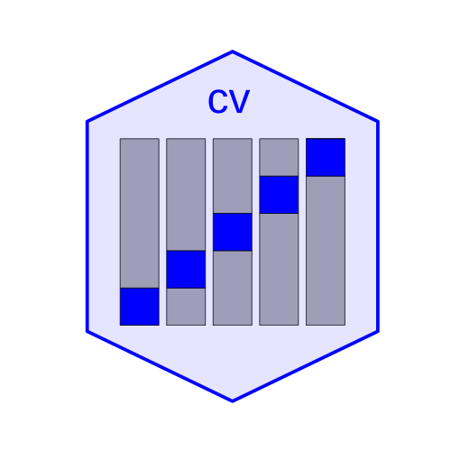

<!-- badges: start -->
  [](https://github.com/gmonette/cv/actions/workflows/R-CMD-check.yaml)
  [](https://lifecycle.r-lib.org/articles/stages.html#experimental)
  [](https://github.com/gmonette/cv)
  <!-- badges: end -->
  
# cv package for R: Various Functions for Cross-Validation of Regression Models 

Some of the functions supplied by the package:

* `cv()` is a generic function with a default method and 
computationally efficient `"lm"` and `"glm"` methods. There are also experimental `"merMod"` and `"lme"` methods for mixed-effects models.

* `mse()` (mean-squared error) and `BayesRule()` are cross-validation
criteria ("cost functions"), suitable for use with `cv()`.

* `cvSelect()` cross-validates a selection procedure for a regression
model. 

* `selectStepAIC()` is a model-selection procedure, suitable for
use with `cvSelect()`, based on the `stepAIC()` function in the **MASS** 
package.

* `selectTrans()` is a procedure for selecting predictor and response transformations in regression, also suitable for use with `cvSelect()`, based on the `powerTransform()` function in the **car** package.

For the time-being the package resides only on GitHub, but we anticipate
eventually submitting it to CRAN.

To install the package:

```
if (!require(remotes)) install.packages("remotes")
remotes::install_github("gmonette/cv", build_vignettes=TRUE,
  dependencies=TRUE)
```

