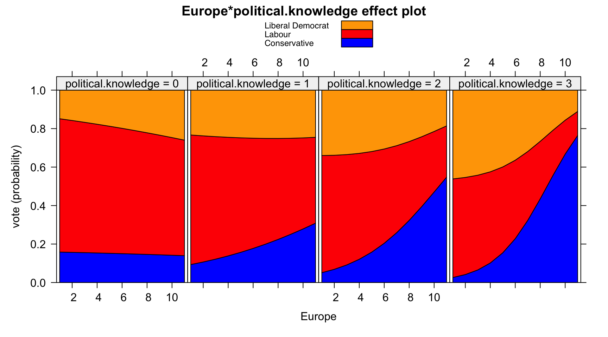

# Extending the cv package

The **cv** package is designed to be extensible in several directions.
In this vignette, we discuss three kinds of extensions, ordered by
increasing general complexity: (1) adding a cross-validation cost
criterion; (2) adding a model class that’s not directly accommodated by
the [`cv()`](https://gmonette.github.io/cv/reference/cv.md) default
method or by another directly inherited method, with separate
consideration of mixed-effects models; and (3) adding a new
model-selection procedure suitable for use with `selectModel()`.

## Adding a cost criterion

A cost criterion suitable for use with
[`cv()`](https://gmonette.github.io/cv/reference/cv.md) or
[`cvSelect()`](https://gmonette.github.io/cv/reference/cvCompute.md)
should take two arguments, `y` (the observed response vector) and `yhat`
(a vector of fitted or predicted response values), and return a numeric
index of lack of fit. The **cv** package supplies several such criteria:
`mse(y, yhat)`, which returns the mean-squared prediction error for a
numeric response; `rmse(y, yhat)`, which returns the (square-)root
mean-squared error; `medAbsErr(y, yhat)`, which returns the median
absolute error; and `BayesRule(y, yhat)` (and its non-error-checking
version, `BayesRule2(y, yhat))`, suitable for use with a binary
regression model, where `y` is the binary response coded `0` for a
“failure” or `1` for a “success”; where `yhat` is the predicted
probability of success; and where the proportion of *incorrectly*
classified cases is returned.

To illustrate using a different prediction cost criterion, we’ll base a
cost criterion on the area under the receiver operating characteristic
(“ROC”) curve for a logistic regression. The ROC curve is a graphical
representation of the classification power of a binary regression model,
and the area under the ROC curve (“AUC”), which varies from 0 to 1, is a
common summary measure based on the ROC (see "Receiver operating
characteristic", 2023). The **Metrics** package (Hamner & Frasco, 2018)
includes a variety of measures useful for model selection, including an
`auc()` function. We convert the AUC into a cost measure by taking its
complement:

``` r

AUCcomp <- function(y, yhat) 1 - Metrics::auc(y, yhat)
```

We then apply `AUCcomp()` to the the Mroz logistic regression, discussed
in the introductory vignette on cross-validating regression models,
which we reproduce here. Using the `Mroz` data frame from the
**carData** package (Fox & Weisberg, 2019):

``` r

data("Mroz", package="carData")
m.mroz <- glm(lfp ~ ., data=Mroz, family=binomial)
summary(m.mroz)
#> 
#> Call:
#> glm(formula = lfp ~ ., family = binomial, data = Mroz)
#> 
#> Coefficients:
#>             Estimate Std. Error z value Pr(>|z|)    
#> (Intercept)  3.18214    0.64438    4.94  7.9e-07 ***
#> k5          -1.46291    0.19700   -7.43  1.1e-13 ***
#> k618        -0.06457    0.06800   -0.95  0.34234    
#> age         -0.06287    0.01278   -4.92  8.7e-07 ***
#> wcyes        0.80727    0.22998    3.51  0.00045 ***
#> hcyes        0.11173    0.20604    0.54  0.58762    
#> lwg          0.60469    0.15082    4.01  6.1e-05 ***
#> inc         -0.03445    0.00821   -4.20  2.7e-05 ***
#> ---
#> Signif. codes:  0 '***' 0.001 '**' 0.01 '*' 0.05 '.' 0.1 ' ' 1
#> 
#> (Dispersion parameter for binomial family taken to be 1)
#> 
#>     Null deviance: 1029.75  on 752  degrees of freedom
#> Residual deviance:  905.27  on 745  degrees of freedom
#> AIC: 921.3
#> 
#> Number of Fisher Scoring iterations: 4

AUCcomp(with(Mroz, as.numeric(lfp == "yes")), fitted(m.mroz))
#> [1] 0.26362
```

Cross-validating this cost measure is straightforward:

``` r

library("cv")
#> Loading required package: doParallel
#> Loading required package: foreach
#> Loading required package: iterators
#> Loading required package: parallel
cv(m.mroz, criterion=AUCcomp, seed=3639)
#> R RNG seed set to 3639
#> cross-validation criterion (AUCcomp) = 0.27471
```

As expected, the cross-validated complement to the AUC is somewhat less
optimistic than the criterion computed from the model fit to the whole
data set.

As we explain in the vignette “Cross-validating regression models,” the
[`cv()`](https://gmonette.github.io/cv/reference/cv.md) function
differentiates between CV criteria that are averages of casewise
components and criteria that are not. Computation of bias corrections
and confidence intervals is limited to the former. We show in the
technical and computational vignette that the AUC, and hence its
complement, cannot be expressed as averages of casewise components.

[`cv()`](https://gmonette.github.io/cv/reference/cv.md) looks for a
`"casewise loss"` attribute of the value returned by a CV criterion
function. If this attribute exists, then the criterion is treated as the
mean of casewise components, and
[`cv()`](https://gmonette.github.io/cv/reference/cv.md) uses the
unexported function `getLossFn()` to construct a function that returns
the casewise components of the criterion.

We illustrate with the
[`mse()`](https://gmonette.github.io/cv/reference/cost-functions.md):

``` r

mse
#> function (y, yhat) 
#> {
#>     result <- mean((y - yhat)^2)
#>     attr(result, "casewise loss") <- "(y - yhat)^2"
#>     result
#> }
#> <bytecode: 0x13341d9a8>
#> <environment: namespace:cv>

cv:::getLossFn(mse(rnorm(100), rnorm(100)))
#> function (y, yhat) 
#> {
#>     (y - yhat)^2
#> }
#> <environment: 0x13345bbd8>
```

For this scheme to work, the “casewise loss” attribute must be a
character string (or vector of character strings), here
`"(y - yhat)^2"`, that evaluates to an expression that is a function of
`y` and `yhat`, and that computes the vector of casewise components of
the CV criterion.

## Adding a model class not covered by the default `cv()` method

### Independently sampled cases

Suppose that we want to cross-validate a multinomial logistic regression
model fit by the
[`multinom()`](https://rdrr.io/pkg/nnet/man/multinom.html) function in
the **nnet** package (Venables & Ripley, 2002). We borrow an example
from Fox (2016, sec. 14.2.1), with data from the British Election Panel
Study on vote choice in the 2001 British election. Data for the example
are in the `BEPS` data frame in the **carData** package:

``` r

data("BEPS", package="carData")
head(BEPS)
#>               vote age economic.cond.national economic.cond.household Blair
#> 1 Liberal Democrat  43                      3                       3     4
#> 2           Labour  36                      4                       4     4
#> 3           Labour  35                      4                       4     5
#> 4           Labour  24                      4                       2     2
#> 5           Labour  41                      2                       2     1
#> 6           Labour  47                      3                       4     4
#>   Hague Kennedy Europe political.knowledge gender
#> 1     1       4      2                   2 female
#> 2     4       4      5                   2   male
#> 3     2       3      3                   2   male
#> 4     1       3      4                   0 female
#> 5     1       4      6                   2   male
#> 6     4       2      4                   2   male
```

The polytomous (multi-category) response variable is `vote`, a factor
with levels `"Conservative"`, `"Labour"`, and `"Liberal Democrat"`. The
predictors of `vote` are:

- `age`, in years;
- `econ.cond.national` and `econ.cond.household`, the respondent’s
  ratings of the state of the economy, on 1 to 5 scales.
- `Blair`, `Hague`, and `Kennedy`, ratings of the leaders of the Labour,
  Conservative, and Liberal Democratic parties, on 1 to 5 scales.
- `Europe`, an 11-point scale on attitude towards European integration,
  with high scores representing “Euro-skepticism.”
- `political.knowledge`, knowledge of the parties’ positions on European
  integration, with scores from 0 to 3.
- `gender`, `"female"` or `"male"`.

The model fit to the data includes an interaction between `Europe` and
`political.knowledge`; the other predictors enter the model additively:

``` r

library("nnet")
m.beps <- multinom(
  vote ~ age + gender + economic.cond.national +
    economic.cond.household + Blair + Hague + Kennedy +
    Europe * political.knowledge,
  data = BEPS
)
#> # weights:  36 (22 variable)
#> initial  value 1675.383740 
#> iter  10 value 1240.047788
#> iter  20 value 1163.199642
#> iter  30 value 1116.519687
#> final  value 1116.519666 
#> converged

car::Anova(m.beps)
#> Registered S3 method overwritten by 'car':
#>   method           from
#>   na.action.merMod lme4
#> Analysis of Deviance Table (Type II tests)
#> 
#> Response: vote
#>                            LR Chisq Df Pr(>Chisq)    
#> age                            13.9  2    0.00097 ***
#> gender                          0.5  2    0.79726    
#> economic.cond.national         30.6  2    2.3e-07 ***
#> economic.cond.household         5.7  2    0.05926 .  
#> Blair                         135.4  2    < 2e-16 ***
#> Hague                         166.8  2    < 2e-16 ***
#> Kennedy                        68.9  2    1.1e-15 ***
#> Europe                         78.0  2    < 2e-16 ***
#> political.knowledge            55.6  2    8.6e-13 ***
#> Europe:political.knowledge     50.8  2    9.3e-12 ***
#> ---
#> Signif. codes:  0 '***' 0.001 '**' 0.01 '*' 0.05 '.' 0.1 ' ' 1
```

Most of the predictors, including the `Europe`
$`\times`$`political.knowledge` interaction, are associated with very
small $`p`$-values; the `Anova()` function is from the **car** package
(Fox & Weisberg, 2019).

Here’s an “effect plot”, using the the **effects** package (Fox &
Weisberg, 2019) to visualize the `Europe`
$`\times`$`political.knowledge` interaction in a “stacked-area” graph:

``` r

plot(
  effects::Effect(
    c("Europe", "political.knowledge"),
    m.beps,
    xlevels = list(Europe = 1:11, political.knowledge = 0:3),
    fixed.predictors = list(given.values = c(gendermale = 0.5))
  ),
  lines = list(col = c("blue", "red", "orange")),
  axes = list(x = list(rug = FALSE), y = list(style = "stacked"))
)
```



To cross-validate this multinomial-logit model we need an appropriate
cost criterion. None of the criteria supplied by the **cv** package—for
example, neither
[`mse()`](https://gmonette.github.io/cv/reference/cost-functions.md),
which is appropriate for a numeric response, nor
[`BayesRule()`](https://gmonette.github.io/cv/reference/cost-functions.md),
which is appropriate for a binary response—will do. One possibility is
to adapt Bayes rule to a polytomous response:

``` r

head(BEPS$vote)
#> [1] Liberal Democrat Labour           Labour           Labour          
#> [5] Labour           Labour          
#> Levels: Conservative Labour Liberal Democrat
yhat <- predict(m.beps, type = "class")
head(yhat)
#> [1] Labour           Labour           Labour           Labour          
#> [5] Liberal Democrat Labour          
#> Levels: Conservative Labour Liberal Democrat

BayesRuleMulti <- function(y, yhat) {
  result <- mean(y != yhat)
  attr(result, "casewise loss") <- "y != yhat"
  result
}

BayesRuleMulti(BEPS$vote, yhat)
#> [1] 0.31869
#> attr(,"casewise loss")
#> [1] "y != yhat"
```

The [`predict()`](https://rdrr.io/r/stats/predict.html) method for
`"multinom"` models called with argument `type="class"` reports the
Bayes-rule prediction for each case—that is, the response category with
the highest predicted probability. Our `BayesRuleMulti()` function
calculates the proportion of misclassified cases. Because this value is
the mean of casewise components, we attach a `"casewise loss"` attribute
to the result (as explained in the preceding section).

The marginal proportions for the response categories are

``` r

xtabs(~ vote, data=BEPS)/nrow(BEPS)
#> vote
#>     Conservative           Labour Liberal Democrat 
#>          0.30295          0.47213          0.22492
```

and so the marginal Bayes-rule prediction, that everyone will vote
Labour, produces an error rate of $`1 - 0.47213 = 0.52787`$. The
multinomial-logit model appears to do substantially better than that,
but does its performance hold up to cross-validation?

We check first whether the default
[`cv()`](https://gmonette.github.io/cv/reference/cv.md) method works
“out-of-the-box” for the `"multinom"` model:

``` r

cv(m.beps, seed=3465, criterion=BayesRuleMulti)
#> Error in `GetResponse.default()`:
#> ! non-vector response
```

The default method of
[`GetResponse()`](https://gmonette.github.io/cv/reference/cvCompute.md)
(a function supplied by the **cv** package—see
[`?GetResponse`](https://gmonette.github.io/cv/reference/cvCompute.md))
fails for a `"multinom"` object. A straightforward solution is to supply
a `GetResponse.multinom()` method that returns the factor response
(using the `get_response()` function from the **insight** package,
Lüdecke, Waggoner, & Makowski, 2019),

``` r

GetResponse.multinom <- function(model, ...) {
  insight::get_response(model)
}

head(GetResponse(m.beps))
#> [1] Liberal Democrat Labour           Labour           Labour          
#> [5] Labour           Labour          
#> Levels: Conservative Labour Liberal Democrat
```

and to try again:

``` r

cv(m.beps, seed=3465, criterion=BayesRuleMulti)
#> R RNG seed set to 3465
#> # weights:  36 (22 variable)
#> initial  value 1507.296060 
#> iter  10 value 1134.575036
#> iter  20 value 1037.413231
#> iter  30 value 1007.705242
#> iter  30 value 1007.705235
#> iter  30 value 1007.705235
#> final  value 1007.705235 
#> converged
#> Error in `match.arg()`:
#> ! 'arg' should be one of "class", "probs"
```

A [`traceback()`](https://rdrr.io/r/base/traceback.html) (not shown)
reveals that the problem is that the default method of
[`cv()`](https://gmonette.github.io/cv/reference/cv.md) calls the
`"multinom"` method for
[`predict()`](https://rdrr.io/r/stats/predict.html) with the argument
`type="response"`, when the correct argument should be `type="class"`.
We therefore must write a “`multinom`” method for
[`cv()`](https://gmonette.github.io/cv/reference/cv.md), but that proves
to be very simple:

``` r

cv.multinom <-
  function (model, data, criterion = BayesRuleMulti, k, reps,
            seed, ...) {
    model <- update(model, trace = FALSE)
    NextMethod(
      type = "class",
      criterion = criterion,
      criterion.name = deparse(substitute(criterion))
    )
  }
```

That is, we simply call the default
[`cv()`](https://gmonette.github.io/cv/reference/cv.md) method with the
`type` argument properly set. In addition to supplying the correct
`type` argument, our method sets the default `criterion` for the
`cv.multinom()` method to `BayesRuleMulti`. Adding the argument
`criterion.name=deparse(substitute(criterion))` is inessential, but it
insures that printed output will include the name of the criterion
function that’s employed, whether it’s the default `BayesRuleMulti` or
something else. Prior to invoking
[`NextMethod()`](https://rdrr.io/r/base/UseMethod.html), we called
[`update()`](https://rdrr.io/r/stats/update.html) with `trace=FALSE` to
suppress the iteration history reported by default by
[`multinom()`](https://rdrr.io/pkg/nnet/man/multinom.html)—it would be
tedious to see the iteration history for each fold.

Then:

``` r

summary(cv(m.beps, seed=3465))
#> R RNG seed set to 3465
#> 10-Fold Cross Validation
#> criterion: BayesRuleMulti
#> cross-validation criterion = 0.32459
#> bias-adjusted cross-validation criterion = 0.32368
#> 95% CI for bias-adjusted CV criterion = (0.30017, 0.34718)
#> full-sample criterion = 0.31869
```

The cross-validated polytomous Bayes-rule criterion confirms that the
fitted model does substantially better than the marginal Bayes-rule
prediction that everyone votes for Labour.

#### Calling cvCompute()

[`cv()`](https://gmonette.github.io/cv/reference/cv.md) methods for
independently sampled cases, such as
[`cv.default()`](https://gmonette.github.io/cv/reference/cv.md),
[`cv.lm()`](https://gmonette.github.io/cv/reference/cv.md), and
[`cv.glm()`](https://gmonette.github.io/cv/reference/cv.md), work by
setting up calls to the
[`cvCompute()`](https://gmonette.github.io/cv/reference/cvCompute.md)
function, which is exported from the **cv** package to support
development of [`cv()`](https://gmonette.github.io/cv/reference/cv.md)
methods for additional classes of regression models. In most cases,
however, such as the preceding `cv.multinom()` example, it will suffice
and be much simpler to set up a suitable call to
[`cv.default()`](https://gmonette.github.io/cv/reference/cv.md) via
[`NextMethod()`](https://rdrr.io/r/base/UseMethod.html).

To illustrate how to use
[`cvCompute()`](https://gmonette.github.io/cv/reference/cvCompute.md)
directly, we write an alternative, and necessarily more complicated,
version of `cv.multinom()`.

``` r

cv.multinom <- function(model,
                        data = insight::get_data(model),
                        criterion = BayesRuleMulti,
                        k = 10,
                        reps = 1,
                        seed = NULL,
                        details = k <= 10,
                        confint = n >= 400,
                        level = 0.95,
                        ncores = 1,
                        start = FALSE,
                        ...) {
  f <- function(i) {
    # helper function to compute to compute fitted values,
    #  etc., for each fold i
    
    indices.i <- fold(folds, i)
    model.i <- if (start) {
      update(model,
             data = data[-indices.i,],
             start = b,
             trace = FALSE)
    } else {
      update(model, data = data[-indices.i,], trace = FALSE)
    }
    fit.all.i <- predict(model.i, newdata = data, type = "class")
    fit.i <- fit.all.i[indices.i]
    # returns:
    #  fit.i: fitted values for the i-th fold
    #  crit.all.i: CV criterion for all cases based on model with
    #              i-th fold omitted
    #  coef.i: coefficients for the model with i-th fold omitted
    list(
      fit.i = fit.i,
      crit.all.i = criterion(y, fit.all.i),
      coef.i = coef(model.i)
    )
  }
  
  fPara <- function(i, multinom, ...) {
    # helper function for parallel computation
    #   argument multinom makes multinom() locally available
    #   ... is necessary but not used
    indices.i <- fold(folds, i)
    model.i <- if (start) {
      update(model,
             data = data[-indices.i,],
             start = b,
             trace = FALSE)
    } else {
      update(model, data = data[-indices.i,], trace = FALSE)
    }
    fit.all.i <- predict(model.i, newdata = data, type = "class")
    fit.i <- fit.all.i[indices.i]
    list(
      fit.i = fit.i,
      crit.all.i = criterion(y, fit.all.i),
      coef.i = coef(model.i)
    )
  }
  
  n <- nrow(data)
  
  # see ?cvCompute for definitions of arguments
  cvCompute(
    model = model,
    data = data,
    criterion = criterion,
    criterion.name = deparse(substitute(criterion)),
    k = k,
    reps = reps,
    seed = seed,
    details = details,
    confint = confint,
    level = level,
    ncores = ncores,
    type = "class",
    start = start,
    f = f,
    fPara = fPara,
    multinom = nnet::multinom
  )
}
```

Notice that separate “helper” functions are defined for non-parallel and
parallel computations.[^1] The new version of `cv.multinom()` produces
the same results as the version that calls
[`cv.default()`](https://gmonette.github.io/cv/reference/cv.md):[^2]

``` r

summary(cv(m.beps, seed=3465))
#> R RNG seed set to 3465
#> 10-Fold Cross Validation
#> criterion: BayesRuleMulti
#> cross-validation criterion = 0.32459
#> bias-adjusted cross-validation criterion = 0.32368
#> 95% CI for bias-adjusted CV criterion = (0.30017, 0.34718)
#> full-sample criterion = 0.31869
```

### Mixed-effects models

Adding a [`cv()`](https://gmonette.github.io/cv/reference/cv.md) method
for a mixed-model class is somewhat more complicated. We provide the
[`cvMixed()`](https://gmonette.github.io/cv/reference/cvCompute.md)
function to facilitate this process, and to see how that works, consider
the `"lme"` method from the **cv** package:

``` r

cv:::cv.lme
#> function (model, data = insight::get_data(model), criterion = mse, 
#>     k = NULL, reps = 1L, seed, details = NULL, ncores = 1L, clusterVariables, 
#>     ...) 
#> {
#>     cvMixed(model, package = "nlme", data = data, criterion = criterion, 
#>         criterion.name = deparse(substitute(criterion)), k = k, 
#>         reps = reps, seed = seed, details = details, ncores = ncores, 
#>         clusterVariables = clusterVariables, predict.clusters.args = list(object = model, 
#>             newdata = data, level = 0), predict.cases.args = list(object = model, 
#>             newdata = data, level = 1), fixed.effects = nlme::fixef, 
#>         ...)
#> }
#> <bytecode: 0x126414c60>
#> <environment: namespace:cv>
```

Notice that
[`cv.lme()`](https://gmonette.github.io/cv/reference/cv.merMod.md) sets
up a call to
[`cvMixed()`](https://gmonette.github.io/cv/reference/cvCompute.md),
which does the computational work.

Most of the arguments of
[`cvMixed()`](https://gmonette.github.io/cv/reference/cvCompute.md) are
familiar:

- `model` is the mixed-model object, here of class `"lme"`.

- `package` is the name of the package in which the mixed-modeling
  function used to fit the model, here
  [`lme()`](https://rdrr.io/pkg/nlme/man/lme.html), resides—i.e.,
  `"nlme"`;
  [`cvMixed()`](https://gmonette.github.io/cv/reference/cvCompute.md)
  uses this argument to retrieve the package namespace.

- `data` is the data set to which the model is fit, by default extracted
  by the `get_data()` function in the **insight** package.

- `criterion` is the CV criterion, defaulting to the
  [`mse()`](https://gmonette.github.io/cv/reference/cost-functions.md)
  function.

- `k` is the number of CV folds, defaulting to `"loo"` for CV by
  clusters and `10` for CV by cases.

- `reps` is the number of times the CV process is repeated, defaulting
  to `1`.

- `seed` is the seed for R’s random-number generator, defaulting to a
  randomly selected (and saved) value.

- `ncores` is the number of cores to use for parallel computation; if
  `1`, the default, then the computation isn’t parallelized.

- `clusterVariables` is a character vector of the names of variables
  defining clusters; if missing, then CV is based on cases rather than
  clusters.

The remaining arguments are unfamiliar:

- `predict.clusters.args` is a named list of arguments to be passed to
  the [`predict()`](https://rdrr.io/r/stats/predict.html) function to
  obtain predictions for the full data set from a model fit to a subset
  of the data for cluster-based CV. The first two arguments should be
  `object` and `newdata`. It is typically necessary to tell
  [`cvMixed()`](https://gmonette.github.io/cv/reference/cvCompute.md)
  how to base predictions only on fixed effects; in the case of `"lme"`
  models, this is done by setting `level = 0`.

- Similarly, `predict.cases.args` is a named list of arguments to be
  passed to [`predict()`](https://rdrr.io/r/stats/predict.html) for
  case-based CV. Setting `level = 1` includes random effects in the
  predictions.

- `fixed.effects` is used to compute detailed fold-based statistics.

Finally, any additional arguments, absorbed by `...`, are passed to
[`update()`](https://rdrr.io/r/stats/update.html) when the model is
refit with each fold omitted.
[`cvMixed()`](https://gmonette.github.io/cv/reference/cvCompute.md)
returns an object of class `"cv"`.

Now imagine that we want to support a new class of mixed-effects models.
To be concrete, we illustrate with the
[`glmmPQL()`](https://rdrr.io/pkg/MASS/man/glmmPQL.html) function in the
**MASS** package (Venables & Ripley, 2002), which fits
generalized-linear mixed-effects models by penalized
quasi-likelihood.[^3] Not coincidentally, the arguments of
[`glmmPQL()`](https://rdrr.io/pkg/MASS/man/glmmPQL.html) are similar to
those of [`lme()`](https://rdrr.io/pkg/nlme/man/lme.html) (with an
additional `family` argument), because the former iteratively invokes
the latter; so `cv.glmmPQL()` should resemble
[`cv.lme()`](https://gmonette.github.io/cv/reference/cv.merMod.md).

As it turns out, neither the default method for
[`GetResponse()`](https://gmonette.github.io/cv/reference/cvCompute.md)
nor
[`insight::get_data()`](https://easystats.github.io/insight/reference/get_data.html)
work for `"glmmPQL"` objects. These objects include a `"data"` element,
however, and so we can simply extract this element as the default for
the `data` argument of our `cv.glmmPQL()` method.

To get the response variable is more complicated: We refit the fixed
part of the model as a GLM with only the regression constant on the
right-hand side, and extract the response from that; because all we need
is the response variable, we limit the number of GLM iterations to 1 and
suppress warning messages about non-convergence:

``` r

GetResponse.glmmPQL <- function(model, ...) {
  f <- formula(model)
  f[[3]] <- 1 # regression constant only on RHS
  model <-
    suppressWarnings(glm(
      f,
      data = model$data,
      family = model$family,
      control = list(maxit = 1)
    ))
  cv::GetResponse(model)
}
```

Writing the [`cv()`](https://gmonette.github.io/cv/reference/cv.md)
method is then straightforward:

``` r

cv.glmmPQL <- function(model,
                       data = model$data,
                       criterion = mse,
                       k,
                       reps = 1,
                       seed,
                       ncores = 1,
                       clusterVariables,
                       ...) {
  cvMixed(
    model,
    package = "MASS",
    data = data,
    criterion = criterion,
    k = k,
    reps = reps,
    seed = seed,
    ncores = ncores,
    clusterVariables = clusterVariables,
    predict.clusters.args = list(
      object = model,
      newdata = data,
      level = 0,
      type = "response"
    ),
    predict.cases.args = list(
      object = model,
      newdata = data,
      level = 1,
      type = "response"
    ),
    fixed.effects = nlme::fixef, 
    verbose = FALSE,
    ...
  )
}
```

We set the argument `verbose=FALSE` to suppress
[`glmmPQL()`](https://rdrr.io/pkg/MASS/man/glmmPQL.html)’s iteration
counter when
[`cvMixed()`](https://gmonette.github.io/cv/reference/cvCompute.md)
calls [`update()`](https://rdrr.io/r/stats/update.html).

Let’s apply our newly minted method to a logistic regression with a
random intercept in an example that appears in
[`?glmmPQL`](https://rdrr.io/pkg/MASS/man/glmmPQL.html):

``` r

library("MASS")
m.pql <- glmmPQL(
  y ~ trt + I(week > 2),
  random = ~ 1 | ID,
  family = binomial,
  data = bacteria
)
#> iteration 1
#> iteration 2
#> iteration 3
#> iteration 4
#> iteration 5
#> iteration 6
summary(m.pql)
#> Linear mixed-effects model fit by maximum likelihood
#>   Data: bacteria 
#>   AIC BIC logLik
#>    NA  NA     NA
#> 
#> Random effects:
#>  Formula: ~1 | ID
#>         (Intercept) Residual
#> StdDev:      1.4106  0.78005
#> 
#> Variance function:
#>  Structure: fixed weights
#>  Formula: ~invwt 
#> Fixed effects:  y ~ trt + I(week > 2) 
#>                   Value Std.Error  DF t-value p-value
#> (Intercept)      3.4120   0.51850 169  6.5805  0.0000
#> trtdrug         -1.2474   0.64406  47 -1.9367  0.0588
#> trtdrug+        -0.7543   0.64540  47 -1.1688  0.2484
#> I(week > 2)TRUE -1.6073   0.35834 169 -4.4853  0.0000
#>  Correlation: 
#>                 (Intr) trtdrg trtdr+
#> trtdrug         -0.598              
#> trtdrug+        -0.571  0.460       
#> I(week > 2)TRUE -0.537  0.047 -0.001
#> 
#> Standardized Within-Group Residuals:
#>      Min       Q1      Med       Q3      Max 
#> -5.19854  0.15723  0.35131  0.49495  1.74488 
#> 
#> Number of Observations: 220
#> Number of Groups: 50
```

We compare this result to that obtained from
[`glmer()`](https://rdrr.io/pkg/lme4/man/glmer.html) in the **lme4**
package:

``` r

library("lme4")
#> Loading required package: Matrix
m.glmer <- glmer(y ~ trt + I(week > 2) + (1 | ID),
                 family = binomial, data = bacteria)
summary(m.glmer)
#> Generalized linear mixed model fit by maximum likelihood (Laplace
#>   Approximation) [glmerMod]
#>  Family: binomial  ( logit )
#> Formula: y ~ trt + I(week > 2) + (1 | ID)
#>    Data: bacteria
#> 
#>       AIC       BIC    logLik -2*log(L)  df.resid 
#>     202.3     219.2     -96.1     192.3       215 
#> 
#> Scaled residuals: 
#>    Min     1Q Median     3Q    Max 
#> -4.561  0.136  0.302  0.422  1.128 
#> 
#> Random effects:
#>  Groups Name        Variance Std.Dev.
#>  ID     (Intercept) 1.54     1.24    
#> Number of obs: 220, groups:  ID, 50
#> 
#> Fixed effects:
#>                 Estimate Std. Error z value Pr(>|z|)    
#> (Intercept)        3.548      0.696    5.10  3.4e-07 ***
#> trtdrug           -1.367      0.677   -2.02  0.04352 *  
#> trtdrug+          -0.783      0.683   -1.15  0.25193    
#> I(week > 2)TRUE   -1.598      0.476   -3.36  0.00078 ***
#> ---
#> Signif. codes:  0 '***' 0.001 '**' 0.01 '*' 0.05 '.' 0.1 ' ' 1
#> 
#> Correlation of Fixed Effects:
#>             (Intr) trtdrg trtdr+
#> trtdrug     -0.593              
#> trtdrug+    -0.537  0.487       
#> I(wk>2)TRUE -0.656  0.126  0.064

# comparison of fixed effects:
car::compareCoefs(m.pql, m.glmer) 
#> Warning in car::compareCoefs(m.pql, m.glmer): models to be compared are of
#> different classes
#> Calls:
#> 1: glmmPQL(fixed = y ~ trt + I(week > 2), random = ~1 | ID, family = 
#>   binomial, data = bacteria)
#> 2: glmer(formula = y ~ trt + I(week > 2) + (1 | ID), data = bacteria, 
#>   family = binomial)
#> 
#>                 Model 1 Model 2
#> (Intercept)       3.412   3.548
#> SE                0.514   0.696
#>                                
#> trtdrug          -1.247  -1.367
#> SE                0.638   0.677
#>                                
#> trtdrug+         -0.754  -0.783
#> SE                0.640   0.683
#>                                
#> I(week > 2)TRUE  -1.607  -1.598
#> SE                0.355   0.476
#> 
```

The two sets of estimates are similar, but not identical

Finally, we try out our `cv.glmmPQL()` method, cross-validating both by
clusters and by cases,

``` r

summary(cv(m.pql, clusterVariables="ID", criterion=BayesRule))
#> n-Fold Cross Validation based on 50 {ID} clusters
#> cross-validation criterion = 0.19545
#> bias-adjusted cross-validation criterion = 0.19545
#> full-sample criterion = 0.19545

summary(cv(m.pql, data=bacteria, criterion=BayesRule, seed=1490))
#> R RNG seed set to 1490
#> 10-Fold Cross Validation
#> cross-validation criterion = 0.20909
#> bias-adjusted cross-validation criterion = 0.20727
#> full-sample criterion = 0.14545
```

and again compare to
[`glmer()`](https://rdrr.io/pkg/lme4/man/glmer.html):

``` r

summary(cv(m.glmer, clusterVariables="ID", criterion=BayesRule))
#> n-Fold Cross Validation based on 50 {ID} clusters
#> criterion: BayesRule
#> cross-validation criterion = 0.19545
#> bias-adjusted cross-validation criterion = 0.19545
#> full-sample criterion = 0.19545

summary(cv(m.glmer, data=bacteria, criterion=BayesRule, seed=1490))
#> R RNG seed set to 1490
#> 10-Fold Cross Validation
#> criterion: BayesRule
#> cross-validation criterion = 0.19545
#> bias-adjusted cross-validation criterion = 0.19364
#> full-sample criterion = 0.15
```

## Adding a model-selection procedure

The
[`selectStepAIC()`](https://gmonette.github.io/cv/reference/cv.function.md)
function supplied by the **cv** package, which is based on the
[`stepAIC()`](https://rdrr.io/pkg/MASS/man/stepAIC.html) function from
the **nnet** package (Venables & Ripley, 2002) for stepwise model
selection, is suitable for the `procedure` argument of
[`cvSelect()`](https://gmonette.github.io/cv/reference/cvCompute.md).
The use of
[`selectStepAIC()`](https://gmonette.github.io/cv/reference/cv.function.md)
is illustrated in the vignette on cross-validating model selection.

We’ll employ
[`selectStepAIC()`](https://gmonette.github.io/cv/reference/cv.function.md)
as a “template” for writing a CV model-selection procedure. To see the
code for this function, type
[`cv::selectStepAIC`](https://gmonette.github.io/cv/reference/cv.function.md)
at the R command prompt, or examine the sources for the **cv** package
at <https://github.com/gmonette/cv> (the code for
[`selectStepAIC()`](https://gmonette.github.io/cv/reference/cv.function.md)
is in <https://github.com/gmonette/cv/blob/main/R/cv-select.R>).

Another approach to model selection is all-subsets regression. The
[`regsubsets()`](https://rdrr.io/pkg/leaps/man/regsubsets.html) function
in the **leaps** package (Lumley & Miller, 2020) implements an efficient
algorithm for selecting the best-fitting linear least-squares
regressions for subsets of predictors of all sizes, from 1 through the
maximum number of candidate predictors.[^4] To illustrate the use of
[`regsubsets()`](https://rdrr.io/pkg/leaps/man/regsubsets.html), we
employ the `swiss` data frame supplied by the **leaps** package:

``` r

library("leaps")
head(swiss)
#>              Fertility Agriculture Examination Education Catholic
#> Courtelary        80.2        17.0          15        12     9.96
#> Delemont          83.1        45.1           6         9    84.84
#> Franches-Mnt      92.5        39.7           5         5    93.40
#> Moutier           85.8        36.5          12         7    33.77
#> Neuveville        76.9        43.5          17        15     5.16
#> Porrentruy        76.1        35.3           9         7    90.57
#>              Infant.Mortality
#> Courtelary               22.2
#> Delemont                 22.2
#> Franches-Mnt             20.2
#> Moutier                  20.3
#> Neuveville               20.6
#> Porrentruy               26.6
nrow(swiss)
#> [1] 47
```

The data set includes the following variables, for each of 47
French-speaking Swiss provinces circa 1888:

- `Fertility`: A standardized fertility measure.
- `Agriculture`: The percentage of the male population engaged in
  agriculture.
- `Examination`: The percentage of draftees into the Swiss army
  receiving the highest grade on an examination.
- `Education`: The percentage of draftees with more than a
  primary-school education.
- `Catholic`: The percentage of the population who were Catholic.
- `Infant.Mortality`: The infant-mortality rate, expressed as the
  percentage of live births surviving less than a year.

Following Lumley & Miller (2020), we treat `Fertility` as the response
and the other variables as predictors in a linear least-squares
regression:

``` r

m.swiss <- lm(Fertility ~ ., data=swiss)
summary(m.swiss)
#> 
#> Call:
#> lm(formula = Fertility ~ ., data = swiss)
#> 
#> Residuals:
#>     Min      1Q  Median      3Q     Max 
#> -15.274  -5.262   0.503   4.120  15.321 
#> 
#> Coefficients:
#>                  Estimate Std. Error t value Pr(>|t|)    
#> (Intercept)       66.9152    10.7060    6.25  1.9e-07 ***
#> Agriculture       -0.1721     0.0703   -2.45   0.0187 *  
#> Examination       -0.2580     0.2539   -1.02   0.3155    
#> Education         -0.8709     0.1830   -4.76  2.4e-05 ***
#> Catholic           0.1041     0.0353    2.95   0.0052 ** 
#> Infant.Mortality   1.0770     0.3817    2.82   0.0073 ** 
#> ---
#> Signif. codes:  0 '***' 0.001 '**' 0.01 '*' 0.05 '.' 0.1 ' ' 1
#> 
#> Residual standard error: 7.17 on 41 degrees of freedom
#> Multiple R-squared:  0.707,  Adjusted R-squared:  0.671 
#> F-statistic: 19.8 on 5 and 41 DF,  p-value: 5.59e-10

summary(cv(m.swiss, seed=8433))
#> R RNG seed set to 8433
#> 10-Fold Cross Validation
#> method: Woodbury
#> criterion: mse
#> cross-validation criterion = 59.683
#> bias-adjusted cross-validation criterion = 58.846
#> full-sample criterion = 44.788
```

Thus, the MSE for the model fit to the complete data is considerably
smaller than the CV estimate of the MSE. Can we do better by selecting a
subset of the predictors, taking account of the additional uncertainty
induced by model selection?

First, let’s apply best-subset selection to the complete data set:

``` r

swiss.sub <- regsubsets(Fertility ~ ., data=swiss)
summary(swiss.sub)
#> Subset selection object
#> Call: regsubsets.formula(Fertility ~ ., data = swiss)
#> 5 Variables  (and intercept)
#>                  Forced in Forced out
#> Agriculture          FALSE      FALSE
#> Examination          FALSE      FALSE
#> Education            FALSE      FALSE
#> Catholic             FALSE      FALSE
#> Infant.Mortality     FALSE      FALSE
#> 1 subsets of each size up to 5
#> Selection Algorithm: exhaustive
#>          Agriculture Examination Education Catholic Infant.Mortality
#> 1  ( 1 ) " "         " "         "*"       " "      " "             
#> 2  ( 1 ) " "         " "         "*"       "*"      " "             
#> 3  ( 1 ) " "         " "         "*"       "*"      "*"             
#> 4  ( 1 ) "*"         " "         "*"       "*"      "*"             
#> 5  ( 1 ) "*"         "*"         "*"       "*"      "*"

(bics <- summary(swiss.sub)$bic)
#> [1] -19.603 -28.611 -35.656 -37.234 -34.553
which.min(bics)
#> [1] 4

car::subsets(swiss.sub, legend="topright")
```


Selecting the best model of each size.

The graph, produced by the `subsets()` function in the **car** package,
shows that the model with the smallest BIC is the “best” model with 4
predictors, including `Agriculture`, `Education`, `Catholic`, and
`Infant.Mortality`, but not `Examination`:

``` r

m.best <- update(m.swiss, . ~ . - Examination)
summary(m.best)
#> 
#> Call:
#> lm(formula = Fertility ~ Agriculture + Education + Catholic + 
#>     Infant.Mortality, data = swiss)
#> 
#> Residuals:
#>     Min      1Q  Median      3Q     Max 
#> -14.676  -6.052   0.751   3.166  16.142 
#> 
#> Coefficients:
#>                  Estimate Std. Error t value Pr(>|t|)    
#> (Intercept)       62.1013     9.6049    6.47  8.5e-08 ***
#> Agriculture       -0.1546     0.0682   -2.27   0.0286 *  
#> Education         -0.9803     0.1481   -6.62  5.1e-08 ***
#> Catholic           0.1247     0.0289    4.31  9.5e-05 ***
#> Infant.Mortality   1.0784     0.3819    2.82   0.0072 ** 
#> ---
#> Signif. codes:  0 '***' 0.001 '**' 0.01 '*' 0.05 '.' 0.1 ' ' 1
#> 
#> Residual standard error: 7.17 on 42 degrees of freedom
#> Multiple R-squared:  0.699,  Adjusted R-squared:  0.671 
#> F-statistic: 24.4 on 4 and 42 DF,  p-value: 1.72e-10

summary(cv(m.best, seed=8433)) # use same folds as before
#> R RNG seed set to 8433
#> 10-Fold Cross Validation
#> method: Woodbury
#> criterion: mse
#> cross-validation criterion = 58.467
#> bias-adjusted cross-validation criterion = 57.778
#> full-sample criterion = 45.916
```

The MSE for the selected model is (of course) slightly higher than for
the full model fit previously, but the cross-validated MSE is a bit
lower; as we explain in the vignette on cross-validating model
selection, however, it isn’t kosher to select and cross-validate a model
on the same data.

Here’s a function named `selectSubsets()`, meant to be used with
[`cvSelect()`](https://gmonette.github.io/cv/reference/cvCompute.md),
suitable for cross-validating the model-selection process:

``` r

selectSubsets <- function(data = insight::get_data(model),
                          model,
                          indices,
                          criterion = mse,
                          details = TRUE,
                          seed,
                          save.model = FALSE,
                          ...) {
  if (inherits(model, "lm", which = TRUE) != 1)
    stop("selectSubsets is appropriate only for 'lm' models")
  
  y <- GetResponse(model)
  formula <- formula(model)
  X <- model.matrix(model)
  
  if (missing(indices)) {
    if (missing(seed) || is.null(seed))
      seed <- sample(1e6, 1L)
    # select the best model from the full data by BIC
    sel <- leaps::regsubsets(formula, data = data, ...)
    bics <- summary(sel)$bic
    best <- coef(sel, 1:length(bics))[[which.min(bics)]]
    x.names <- names(best)
    # fit the best model; intercept is already in X, hence - 1:
    m.best <- lm(y ~ X[, x.names] - 1)
    fit.all <- predict(m.best, newdata = data)
    return(list(
      criterion = criterion(y, fit.all),
      model = if (save.model)
        m.best # return best model
      else
        NULL
    ))
  }
  
  # select the best model omitting the i-th fold (given by indices)
  sel.i <- leaps::regsubsets(formula, data[-indices,], ...)
  bics.i <- summary(sel.i)$bic
  best.i <- coef(sel.i, 1:length(bics.i))[[which.min(bics.i)]]
  x.names.i <- names(best.i)
  m.best.i <- lm(y[-indices] ~ X[-indices, x.names.i] - 1)
  # predict() doesn't work here:
  fit.all.i <- as.vector(X[, x.names.i] %*% coef(m.best.i))
  fit.i <- fit.all.i[indices]
  # return the fitted values for i-th fold, CV criterion for all cases,
  #   and the regression coefficients
  list(
    fit.i = fit.i,
    # fitted values for i-th fold
    crit.all.i = criterion(y, fit.all.i),
    # CV crit for all cases
    coefficients = if (details) {
      # regression coefficients
      coefs <- coef(m.best.i)
      
      # fix coefficient names
      names(coefs) <- sub("X\\[-indices, x.names.i\\]", "",
                          names(coefs))
      
      coefs
    }  else {
      NULL
    }
  )
}
```

A slightly tricky point is that because of scoping issues,
[`predict()`](https://rdrr.io/r/stats/predict.html) doesn’t work with
the model fit omitting the $`i`$th fold, and so the fitted values for
all cases are computed directly as
$`\widehat{\mathbf{y}}_{-i} = \mathbf{X} \mathbf{b}_{-i}`$, where
$`\mathbf{X}`$ is the model-matrix for all of the cases, and
$`\mathbf{b}_{-i}`$ is the vector of least-squares coefficients for the
selected model with the $`i`$th fold omitted.

Additionally, the command
`lm(y[-indices] ~ X[-indices, x.names.i] - 1)`, which is the selected
model with the $`i`$th fold deleted, produces awkward coefficient names
like `"X[-indices, x.names.i]Infant.Mortality"`. Purely for aesthetic
reasons, the command
`sub("X\\[-indices, x.names.i\\]", "", names(coefs))` fixes these
awkward names, removing the extraneous text, `"X[-indices, x.names.i]"`.

Applying `selectSubsets()` to the full data produces the full-data
cross-validated MSE (which we obtained previously):

``` r

selectSubsets(model=m.swiss)
#> $criterion
#> [1] 45.916
#> attr(,"casewise loss")
#> [1] "(y - yhat)^2"
#> 
#> $model
#> NULL
```

Similarly, applying the function to an imaginary “fold” of 5 cases
returns the MSE for the cases in the fold, based on the model selected
and fit to the cases omitting the fold; the MSE for all of the cases,
based on the same model; and the coefficients of the selected model,
which includes 4 or the 5 predictors (and the intercept):

``` r

selectSubsets(model=m.swiss, indices=seq(5, 45, by=10))
#> $fit.i
#> [1] 62.922 67.001 73.157 83.778 32.251
#> 
#> $crit.all.i
#> [1] 46.297
#> attr(,"casewise loss")
#> [1] "(y - yhat)^2"
#> 
#> $coefficients
#>      (Intercept)      Agriculture        Education         Catholic 
#>         63.80452         -0.15895         -1.04218          0.13066 
#> Infant.Mortality 
#>          1.01895
```

Then, using `selectSubsets()` in cross-validation, invoking the
[`cv.function()`](https://gmonette.github.io/cv/reference/cv.function.md)
method for [`cv()`](https://gmonette.github.io/cv/reference/cv.md), we
get:

``` r

cv.swiss <- cv(
  selectSubsets,
  working.model = m.swiss,
  data = swiss,
  seed = 8433 # use same folds
)
#> R RNG seed set to 8433
summary(cv.swiss)
#> 10-Fold Cross Validation
#> criterion: mse
#> cross-validation criterion = 65.835
#> bias-adjusted cross-validation criterion = 63.644
#> full-sample criterion = 45.916
```

Cross-validation shows that model selection exacts a penalty in MSE.
Examining the models selected for the 10 folds reveals that there is
some uncertainty in identifying the predictors in the “best” model, with
`Agriculture` sometimes appearing and sometimes not:

``` r

compareFolds(cv.swiss)
#> CV criterion by folds:
#>   fold.1   fold.2   fold.3   fold.4   fold.5   fold.6   fold.7   fold.8 
#>  76.6964  61.3105 131.1616   9.0662  52.9403  41.0853  51.8768 136.9498 
#>   fold.9  fold.10 
#>  24.1808  82.2587 
#> 
#> Coefficients by folds:
#>         (Intercept) Catholic Education Infant.Mortality Agriculture
#> Fold 1      59.0852   0.1397   -1.0203           1.2985       -0.17
#> Fold 2      67.0335   0.1367   -1.0499           0.9413       -0.20
#> Fold 3      55.0453   0.1221   -0.8757           1.3541       -0.15
#> Fold 4      62.5543   0.1236   -0.9719           1.0679       -0.16
#> Fold 5      50.4643   0.1057   -0.7863           1.2144            
#> Fold 6      68.0289   0.1195   -1.0073           0.8294       -0.17
#> Fold 7      66.5219   0.1357   -1.0827           0.9523       -0.19
#> Fold 8      46.3507   0.0776   -0.7637           1.4463            
#> Fold 9      62.2632   0.1230   -1.0067           1.1000       -0.17
#> Fold 10     52.5112   0.1005   -0.7232           1.0809
```

As well, the fold-wise MSE varies considerably, reflecting the small
size of the `swiss` data set (47 cases).

## References

Fox, J. (2016). *Applied regression analysis and generalized linear
models* (Second edition). Thousand Oaks CA: Sage.

Fox, J., & Weisberg, S. (2019). *An R companion to applied regression*
(Third edition). Thousand Oaks CA: Sage.

Hamner, B., & Frasco, M. (2018). *Metrics: Evaluation metrics for
machine learning*. Retrieved from
<https://CRAN.R-project.org/package=Metrics>

Lüdecke, D., Waggoner, P., & Makowski, D. (2019). insight: A unified
interface to access information from model objects in R. *Journal of
Open Source Software*, *4*(38), 1412.

Lumley, T., & Miller, A. (2020). *leaps: Regression subset selection*.
Retrieved from <https://CRAN.R-project.org/package=leaps>

"Receiver operating characteristic". (2023). Receiver operating
characteristic—Wikipedia, the free encyclopedia. Retrieved from
<https://en.wikipedia.org/wiki/Receiver_operating_characteristic>

Venables, W. N., & Ripley, B. D. (2002). *Modern applied statistics with
S* (Fourth edition). New York: Springer.

[^1]: Try the following, for example, with both versions of
    `cv.multinom()` (possibly replacing `ncores=2` with a larger
    number):

        system.time(print(cv1 <- cv(m.beps, k="loo")))
        system.time(print(cv2 <- cv(m.beps, k="loo", ncores=2)))
        all.equal(cv1, cv2)

[^2]: A subtle point is that we added a `multinom` argument to the local
    function `fPara()`, which is passed to the `fPara` argument of
    [`cvCompute()`](https://gmonette.github.io/cv/reference/cvCompute.md).
    There is also a `multinom` argument to
    [`cvCompute()`](https://gmonette.github.io/cv/reference/cvCompute.md),
    which is set to the `multinom` function in the **nnet** package. The
    `multinom` argument isn’t directly defined in
    [`cvCompute()`](https://gmonette.github.io/cv/reference/cvCompute.md)
    (examine the definition of this function), but is passed through the
    `...` argument.
    [`cvCompute()`](https://gmonette.github.io/cv/reference/cvCompute.md),
    in turn, will pass `multinom` to `fPara()` via `...`, allowing
    `fPara()` to find this function when it calls
    [`update()`](https://rdrr.io/r/stats/update.html) to refit the model
    with each fold `i` omitted. This scoping issue arises because
    [`cvCompute()`](https://gmonette.github.io/cv/reference/cvCompute.md)
    uses `foreach()` for parallel computations, even though the **nnet**
    package is attached to the search path in the current R session via
    [`library("nnet")`](http://www.stats.ox.ac.uk/pub/MASS4/).
    [`cv.default()`](https://gmonette.github.io/cv/reference/cv.md) is
    able to handle the scoping issue transparently by automatically
    locating [`multinom()`](https://rdrr.io/pkg/nnet/man/multinom.html).

[^3]: This example is somewhat artificial in that
    [`glmmPQL()`](https://rdrr.io/pkg/MASS/man/glmmPQL.html) has largely
    been superseded by computationally superior functions, such the
    [`glmer()`](https://rdrr.io/pkg/lme4/man/glmer.html) function in the
    **lme4** package. There is, however, one situation in which
    [`glmmPQL()`](https://rdrr.io/pkg/MASS/man/glmmPQL.html) might prove
    useful: to specify serial dependency in case-level errors within
    clusters for longitudinal data, which is not currently supported by
    [`glmer()`](https://rdrr.io/pkg/lme4/man/glmer.html).

[^4]: The
    [`regsubsets()`](https://rdrr.io/pkg/leaps/man/regsubsets.html)
    function computes several measures of model predictive performance,
    including the $`R^2`$ and $`R^2`$ adjusted for degrees of freedom,
    the residual sums of squares, Mallows’s $`C_p`$, and the BIC.
    Several of these are suitable for comparing models with differing
    numbers of coefficients—we use the BIC below—but all necessarily
    agree when comparing models with the *same* number of coefficients.
