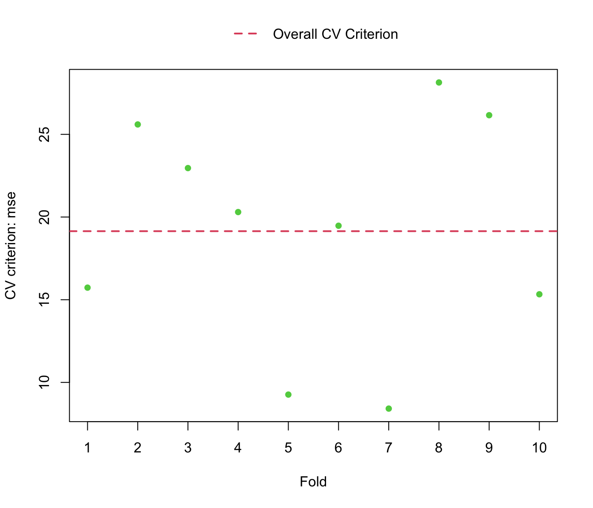

# Cross-validating regression models

This vignette covers the basics of using the **cv** package for
cross-validation. The first, and major, section of the vignette consists
of examples that fit linear and generalized linear models to data sets
with independently sampled cases. Brief sections follow on replicating
cross-validation, manipulating the objects produced by
[`cv()`](https://gmonette.github.io/cv/reference/cv.md) and related
functions, and employing parallel computations.

There are several other vignettes associated with the **cv** package: on
cross-validating mixed-effects models; on cross-validating
model-selection procedures; and on technical details, such as
computational procedures.

## Cross-validation

Cross-validation (CV) is an essentially simple and intuitively
reasonable approach to estimating the predictive accuracy of regression
models. CV is developed in many standard sources on regression modeling
and “machine learning”—we particularly recommend James, Witten, Hastie,
& Tibshirani (2021, secs. 5.1, 5.3)—and so we will describe the method
only briefly here before taking up computational issues and some
examples. See Arlot & Celisse (2010) for a wide-ranging, if technical,
survey of cross-validation and related methods that emphasizes the
statistical properties of CV.

Validating research by replication on independently collected data is a
common scientific norm. Emulating this process in a single study by
data-division is less common: The data are randomly divided into two,
possibly equal-size, parts; the first part is used to develop and fit a
statistical model; and then the second part is used to assess the
adequacy of the model fit to the first part of the data. Data-division,
however, suffers from two problems: (1) Dividing the data decreases the
sample size and thus increases sampling error; and (2), even more
disconcertingly, particularly in smaller samples, the results can vary
substantially based on the random division of the data: See Harrell
(2015, sec. 5.3) for this and other remarks about data-division and
cross-validation.

Cross-validation speaks to both of these issues. In CV, the data are
randomly divided as equally as possible into several, say $`k`$, parts,
called “folds.” The statistical model is fit $`k`$ times, leaving each
fold out in turn. Each fitted model is then used to predict the response
variable for the cases in the omitted fold. A CV criterion or “cost”
measure, such as the mean-squared error (“MSE”) of prediction, is then
computed using these predicted values. In the extreme $`k = n`$, the
number of cases in the data, thus omitting individual cases and
refitting the model $`n`$ times—a procedure termed “leave-one-out (LOO)
cross-validation.”

Because the $`n`$ models are each fit to $`n - 1`$ cases, LOO CV
produces a nearly unbiased estimate of prediction error. The $`n`$
regression models are highly statistically dependent, however, based as
they are on nearly the same data, and so the resulting estimate of
prediction error has larger variance than if the predictions from the
models fit to the $`n`$ data sets were independent.

Because predictions are based on smaller data sets, each of size
approximately $`n - n/k`$, estimated prediction error for $`k`$-fold CV
with $`k = 5`$ or $`10`$ (commonly employed choices) is more biased than
estimated prediction error for LOO CV. It is possible, however, to
correct $`k`$-fold CV for bias (see below).

The relative *variance* of prediction error for LOO CV and $`k`$-fold CV
(with $`k < n`$) is more complicated: Because the overlap between the
data sets with each fold omitted is smaller for $`k`$-fold CV than for
LOO CV, the dependencies among the predictions are smaller for the
former than for the latter, tending to produce smaller variance in
prediction error for $`k`$-fold CV. In contrast, there are factors that
tend to inflate the variance of prediction error in $`k`$-fold CV,
including the reduced size of the data sets with each fold omitted and
the randomness induced by the selection of folds—in LOO CV the folds are
not random.

## Examples

### Polynomial regression for the `Auto` data

The data for this example are drawn from the **ISLR2** package for R,
associated with James et al. (2021). The presentation here is close
(though not identical) to that in the original source (James et al.,
2021, secs. 5.1, 5.3), and it demonstrates the use of the
[`cv()`](https://gmonette.github.io/cv/reference/cv.md) function in the
**cv** package.[^1]

The `Auto` dataset contains information about 392 cars:

``` r

data("Auto", package="ISLR2")
head(Auto)
#>   mpg cylinders displacement horsepower weight acceleration year origin
#> 1  18         8          307        130   3504         12.0   70      1
#> 2  15         8          350        165   3693         11.5   70      1
#> 3  18         8          318        150   3436         11.0   70      1
#> 4  16         8          304        150   3433         12.0   70      1
#> 5  17         8          302        140   3449         10.5   70      1
#> 6  15         8          429        198   4341         10.0   70      1
#>                        name
#> 1 chevrolet chevelle malibu
#> 2         buick skylark 320
#> 3        plymouth satellite
#> 4             amc rebel sst
#> 5               ford torino
#> 6          ford galaxie 500
dim(Auto)
#> [1] 392   9
```

With the exception of `origin` (which we don’t use here), these
variables are largely self-explanatory, except possibly for units of
measurement: for details see
[`help("Auto", package="ISLR2")`](https://rdrr.io/pkg/ISLR2/man/Auto.html).

We’ll focus here on the relationship of `mpg` (miles per gallon) to
`horsepower`, as displayed in the following scatterplot:

``` r

plot(mpg ~ horsepower, data=Auto)
```


`mpg` vs `horsepower` for the `Auto` data

The relationship between the two variables is monotone, decreasing, and
nonlinear. Following James et al. (2021), we’ll consider approximating
the relationship by a polynomial regression, with the degree of the
polynomial $`p`$ ranging from 1 (a linear regression) to 10.[^2]
Polynomial fits for $`p = 1`$ to $`5`$ are shown in the following
figure:

``` r

plot(mpg ~ horsepower, data = Auto)
horsepower <- with(Auto,
                   seq(min(horsepower), max(horsepower),
                       length = 1000))
for (p in 1:5) {
  m <- lm(mpg ~ poly(horsepower, p), data = Auto)
  mpg <- predict(m, newdata = data.frame(horsepower = horsepower))
  lines(horsepower,
        mpg,
        col = p + 1,
        lty = p,
        lwd = 2)
}
legend(
  "topright",
  legend = 1:5,
  col = 2:6,
  lty = 1:5,
  lwd = 2,
  title = "Degree",
  inset = 0.02
)
```


`mpg` vs `horsepower` for the `Auto` data

The linear fit is clearly inappropriate; the fits for $`p = 2`$
(quadratic) through $`4`$ are very similar; and the fit for $`p = 5`$
may over-fit the data by chasing one or two relatively high `mpg` values
at the right (but see the CV results reported below).

The following graph shows two measures of estimated (squared) error as a
function of polynomial-regression degree: The mean-squared error
(“MSE”), defined as
$`\mathsf{MSE} = \frac{1}{n}\sum_{i=1}^n (y_i - \widehat{y}_i)^2`$, and
the usual residual variance, defined as
$`\widehat{\sigma}^2 = \frac{1}{n - p - 1} \sum_{i=1}^n (y_i - \widehat{y}_i)^2`$.
The former necessarily declines with $`p`$ (or, more strictly, can’t
increase with $`p`$), while the latter gets slightly larger for the
largest values of $`p`$, with the “best” value, by a small margin, for
$`p = 7`$.

``` r

library("cv") # for mse() and other functions
#> Loading required package: doParallel
#> Loading required package: foreach
#> Loading required package: iterators
#> Loading required package: parallel

var <- mse <- numeric(10)
for (p in 1:10) {
  m <- lm(mpg ~ poly(horsepower, p), data = Auto)
  mse[p] <- mse(Auto$mpg, fitted(m))
  var[p] <- summary(m)$sigma ^ 2
}

plot(
  c(1, 10),
  range(mse, var),
  type = "n",
  xlab = "Degree of polynomial, p",
  ylab = "Estimated Squared Error"
)
lines(
  1:10,
  mse,
  lwd = 2,
  lty = 1,
  col = 2,
  pch = 16,
  type = "b"
)
lines(
  1:10,
  var,
  lwd = 2,
  lty = 2,
  col = 3,
  pch = 17,
  type = "b"
)
legend(
  "topright",
  inset = 0.02,
  legend = c(expression(hat(sigma) ^ 2), "MSE"),
  lwd = 2,
  lty = 2:1,
  col = 3:2,
  pch = 17:16
)
```


Estimated squared error as a function of polynomial degree, $`p`$

The code for this graph uses the
[`mse()`](https://gmonette.github.io/cv/reference/cost-functions.md)
function from the **cv** package to compute the MSE for each fit.

#### Using `cv()`

The generic [`cv()`](https://gmonette.github.io/cv/reference/cv.md)
function has an `"lm"` method, which by default performs $`k = 10`$-fold
CV:

``` r

m.auto <- lm(mpg ~ poly(horsepower, 2), data = Auto)
summary(m.auto)
#> 
#> Call:
#> lm(formula = mpg ~ poly(horsepower, 2), data = Auto)
#> 
#> Residuals:
#>     Min      1Q  Median      3Q     Max 
#> -14.714  -2.594  -0.086   2.287  15.896 
#> 
#> Coefficients:
#>                      Estimate Std. Error t value Pr(>|t|)    
#> (Intercept)            23.446      0.221   106.1   <2e-16 ***
#> poly(horsepower, 2)1 -120.138      4.374   -27.5   <2e-16 ***
#> poly(horsepower, 2)2   44.090      4.374    10.1   <2e-16 ***
#> ---
#> Signif. codes:  0 '***' 0.001 '**' 0.01 '*' 0.05 '.' 0.1 ' ' 1
#> 
#> Residual standard error: 4.37 on 389 degrees of freedom
#> Multiple R-squared:  0.688,  Adjusted R-squared:  0.686 
#> F-statistic:  428 on 2 and 389 DF,  p-value: <2e-16

cv(m.auto)
#> R RNG seed set to 841111
#> cross-validation criterion (mse) = 19.25
```

The `"lm"` method by default uses
[`mse()`](https://gmonette.github.io/cv/reference/cost-functions.md) as
the CV criterion and the Woodbury matrix identity (Hager, 1989) to
update the regression with each fold deleted without having literally to
refit the model. (Computational details are discussed in a separate
vignette.) The [`print()`](https://rdrr.io/r/base/print.html) method for
`"cv"` objects simply print the cross-validation criterion, here the
MSE. We can use [`summary()`](https://rdrr.io/r/base/summary.html) to
obtain more information (as we’ll do routinely in the sequel):

``` r

summary(cv.m.auto <- cv(m.auto))
#> R RNG seed set to 411860
#> 10-Fold Cross Validation
#> method: Woodbury
#> criterion: mse
#> cross-validation criterion = 19.145
#> bias-adjusted cross-validation criterion = 19.136
#> full-sample criterion = 18.985
```

The summary reports the CV estimate of MSE, a biased-adjusted estimate
of the MSE (the bias adjustment is explained in the final section), and
the MSE is also computed for the original, full-sample regression.
Because the division of the data into 10 folds is random,
[`cv()`](https://gmonette.github.io/cv/reference/cv.md) explicitly
(randomly) generates and saves a seed for R’s pseudo-random number
generator, to make the results replicable. The user can also specify the
seed directly via the `seed` argument to
[`cv()`](https://gmonette.github.io/cv/reference/cv.md).

The [`plot()`](https://rdrr.io/r/graphics/plot.default.html) method for
`"cv"` objects graphs the CV criterion (here MSE) by fold or the
coefficients estimates with each fold deleted:

``` r

plot(cv.m.auto) # CV criterion
```



CV criterion (MSE) for cases in each fold.

``` r

plot(cv.m.auto, what="coefficients") # coefficient estimates
```


Regression coefficients with each fold omitted.

To perform LOO CV, we can set the `k` argument to
[`cv()`](https://gmonette.github.io/cv/reference/cv.md) to the number of
cases in the data, here `k=392`, or, more conveniently, to `k="loo"` or
`k="n"`:

``` r

summary(cv(m.auto, k = "loo"))
#> n-Fold Cross Validation
#> method: hatvalues
#> criterion: mse
#> cross-validation criterion = 19.248
```

For LOO CV of a linear model,
[`cv()`](https://gmonette.github.io/cv/reference/cv.md) by default uses
the hatvalues from the model fit to the full data for the LOO updates,
and reports only the CV estimate of MSE. Alternative methods are to use
the Woodbury matrix identity or the “naive” approach of literally
refitting the model with each case omitted. All three methods produce
exact results for a linear model (within the precision of floating-point
computations):

``` r

summary(cv(m.auto, k = "loo", method = "naive"))
#> n-Fold Cross Validation
#> method: naive
#> criterion: mse
#> cross-validation criterion = 19.248
#> bias-adjusted cross-validation criterion = 19.248
#> full-sample criterion = 18.985

summary(cv(m.auto, k = "loo", method = "Woodbury"))
#> n-Fold Cross Validation
#> method: Woodbury
#> criterion: mse
#> cross-validation criterion = 19.248
#> bias-adjusted cross-validation criterion = 19.248
#> full-sample criterion = 18.985
```

The `"naive"` and `"Woodbury"` methods also return the bias-adjusted
estimate of MSE and the full-sample MSE, but bias isn’t an issue for LOO
CV.

#### Comparing competing models

The [`cv()`](https://gmonette.github.io/cv/reference/cv.md) function
also has a method that can be applied to a list of regression models for
the same data, composed using the
[`models()`](https://gmonette.github.io/cv/reference/cv.modList.md)
function. For $`k`$-fold CV, the same folds are used for the competing
models, which reduces random error in their comparison. This result can
also be obtained by specifying a common seed for R’s random-number
generator while applying
[`cv()`](https://gmonette.github.io/cv/reference/cv.md) separately to
each model, but employing a list of models is more convenient for both
$`k`$-fold and LOO CV (where there is no random component to the
composition of the $`n`$ folds).

We illustrate with the polynomial regression models of varying degree
for the `Auto` data (discussed previously), beginning by fitting and
saving the 10 models:

``` r

for (p in 1:10) {
  command <- paste0("m.", p, "<- lm(mpg ~ poly(horsepower, ", p,
                    "), data=Auto)")
  eval(parse(text = command))
}
objects(pattern = "m\\.[0-9]")
#>  [1] "m.1"  "m.10" "m.2"  "m.3"  "m.4"  "m.5"  "m.6"  "m.7"  "m.8"  "m.9"
summary(m.2) # for example, the quadratic fit
#> 
#> Call:
#> lm(formula = mpg ~ poly(horsepower, 2), data = Auto)
#> 
#> Residuals:
#>     Min      1Q  Median      3Q     Max 
#> -14.714  -2.594  -0.086   2.287  15.896 
#> 
#> Coefficients:
#>                      Estimate Std. Error t value Pr(>|t|)    
#> (Intercept)            23.446      0.221   106.1   <2e-16 ***
#> poly(horsepower, 2)1 -120.138      4.374   -27.5   <2e-16 ***
#> poly(horsepower, 2)2   44.090      4.374    10.1   <2e-16 ***
#> ---
#> Signif. codes:  0 '***' 0.001 '**' 0.01 '*' 0.05 '.' 0.1 ' ' 1
#> 
#> Residual standard error: 4.37 on 389 degrees of freedom
#> Multiple R-squared:  0.688,  Adjusted R-squared:  0.686 
#> F-statistic:  428 on 2 and 389 DF,  p-value: <2e-16
```

The convoluted code within the loop to produce the 10 models insures
that the model formulas are of the form, e.g.,
`mpg ~ poly(horsepower, 2)` rather than `mpg ~ poly(horsepower, p)`,
which may not work properly (see below).

We then apply [`cv()`](https://gmonette.github.io/cv/reference/cv.md) to
the list of 10 models (the `data` argument is required):

``` r

# 10-fold CV
cv.auto.10 <- cv(
  models(m.1, m.2, m.3, m.4, m.5,
         m.6, m.7, m.8, m.9, m.10),
  data = Auto,
  seed = 2120
)
cv.auto.10[1:2] # for the linear and quadratic models
#> Model model.1:
#> cross-validation criterion = 24.246 
#> 
#> Model model.2:
#> cross-validation criterion = 19.346
summary(cv.auto.10)
#> 
#> Model model.1:
#> 10-Fold Cross Validation
#> method: Woodbury
#> cross-validation criterion = 24.246
#> bias-adjusted cross-validation criterion = 24.23
#> full-sample criterion = 23.944
#> 
#> Model model.2:
#> 10-Fold Cross Validation
#> method: Woodbury
#> cross-validation criterion = 19.346
#> bias-adjusted cross-validation criterion = 19.327
#> full-sample criterion = 18.985
#> 
#> Model model.3:
#> 10-Fold Cross Validation
#> method: Woodbury
#> cross-validation criterion = 19.396
#> bias-adjusted cross-validation criterion = 19.373
#> full-sample criterion = 18.945
#> 
#> Model model.4:
#> 10-Fold Cross Validation
#> method: Woodbury
#> cross-validation criterion = 19.444
#> bias-adjusted cross-validation criterion = 19.414
#> full-sample criterion = 18.876
#> 
#> Model model.5:
#> 10-Fold Cross Validation
#> method: Woodbury
#> cross-validation criterion = 19.014
#> bias-adjusted cross-validation criterion = 18.983
#> full-sample criterion = 18.427
#> 
#> Model model.6:
#> 10-Fold Cross Validation
#> method: Woodbury
#> cross-validation criterion = 18.954
#> bias-adjusted cross-validation criterion = 18.916
#> full-sample criterion = 18.241
#> 
#> Model model.7:
#> 10-Fold Cross Validation
#> method: Woodbury
#> cross-validation criterion = 18.898
#> bias-adjusted cross-validation criterion = 18.854
#> full-sample criterion = 18.078
#> 
#> Model model.8:
#> 10-Fold Cross Validation
#> method: Woodbury
#> cross-validation criterion = 19.126
#> bias-adjusted cross-validation criterion = 19.068
#> full-sample criterion = 18.066
#> 
#> Model model.9:
#> 10-Fold Cross Validation
#> method: Woodbury
#> cross-validation criterion = 19.342
#> bias-adjusted cross-validation criterion = 19.269
#> full-sample criterion = 18.027
#> 
#> Model model.10:
#> 10-Fold Cross Validation
#> method: Woodbury
#> cross-validation criterion = 20.012
#> bias-adjusted cross-validation criterion = 19.882
#> full-sample criterion = 18.01

# LOO CV
cv.auto.loo <- cv(models(m.1, m.2, m.3, m.4, m.5,
                         m.6, m.7, m.8, m.9, m.10),
                  data = Auto,
                  k = "loo")
cv.auto.loo[1:2] # linear and quadratic models
#> Model model.1:
#> cross-validation criterion = 24.232 
#> 
#> Model model.2:
#> cross-validation criterion = 19.248
summary(cv.auto.loo)
#> 
#> Model model.1:
#> n-Fold Cross Validation
#> method: hatvalues
#> cross-validation criterion = 24.232
#> 
#> Model model.2:
#> n-Fold Cross Validation
#> method: hatvalues
#> cross-validation criterion = 19.248
#> 
#> Model model.3:
#> n-Fold Cross Validation
#> method: hatvalues
#> cross-validation criterion = 19.335
#> 
#> Model model.4:
#> n-Fold Cross Validation
#> method: hatvalues
#> cross-validation criterion = 19.424
#> 
#> Model model.5:
#> n-Fold Cross Validation
#> method: hatvalues
#> cross-validation criterion = 19.033
#> 
#> Model model.6:
#> n-Fold Cross Validation
#> method: hatvalues
#> cross-validation criterion = 18.979
#> 
#> Model model.7:
#> n-Fold Cross Validation
#> method: hatvalues
#> cross-validation criterion = 18.833
#> 
#> Model model.8:
#> n-Fold Cross Validation
#> method: hatvalues
#> cross-validation criterion = 18.961
#> 
#> Model model.9:
#> n-Fold Cross Validation
#> method: hatvalues
#> cross-validation criterion = 19.069
#> 
#> Model model.10:
#> n-Fold Cross Validation
#> method: hatvalues
#> cross-validation criterion = 19.491
```

Because we didn’t supply names for the models in the calls to the
[`models()`](https://gmonette.github.io/cv/reference/cv.modList.md)
function, the names `model.1`, `model.2`, etc., are generated by the
function.

Finally, we extract and graph the adjusted MSEs for $`10`$-fold CV and
the MSEs for LOO CV (see the section below on manipulating `"cv"`
objects:

``` r

cv.mse.10 <- as.data.frame(cv.auto.10, 
                           rows="cv",             
                           columns="criteria"
                           )$adjusted.criterion
cv.mse.loo <- as.data.frame(cv.auto.loo, 
                           rows="cv",             
                           columns="criteria"
                           )$criterion
plot(
  c(1, 10),
  range(cv.mse.10, cv.mse.loo),
  type = "n",
  xlab = "Degree of polynomial, p",
  ylab = "Cross-Validated MSE"
)
lines(
  1:10,
  cv.mse.10,
  lwd = 2,
  lty = 1,
  col = 2,
  pch = 16,
  type = "b"
)
lines(
  1:10,
  cv.mse.loo,
  lwd = 2,
  lty = 2,
  col = 3,
  pch = 17,
  type = "b"
)
legend(
  "topright",
  inset = 0.02,
  legend = c("10-Fold CV", "LOO CV"),
  lwd = 2,
  lty = 2:1,
  col = 3:2,
  pch = 17:16
)
```


Cross-validated 10-fold and LOO MSE as a function of polynomial degree,
$`p`$

Alternatively, we can use the
[`plot()`](https://rdrr.io/r/graphics/plot.default.html) method for
`"cvModList"` objects to compare the models, though with separate graphs
for 10-fold and LOO CV:

``` r

plot(cv.auto.10, main="Polynomial Regressions, 10-Fold CV",
     axis.args=list(labels=1:10), xlab="Degree of Polynomial, p")
plot(cv.auto.loo, main="Polynomial Regressions, LOO CV",
     axis.args=list(labels=1:10), xlab="Degree of Polynomial, p")
```


Cross-validated 10-fold and LOO MSE as a function of polynomial degree,
$`p`$

In this example, 10-fold and LOO CV produce generally similar results,
and also results that are similar to those produced by the estimated
error variance $`\widehat{\sigma}^2`$ for each model, reported above
(except for the highest-degree polynomials, where the CV results more
clearly suggest over-fitting).

Let’s try fitting the polynomial regressions using a loop with the model
formula `mpg ~ poly(horsepower, p)` (fitting 3 rather than 10 polynomial
regressions for brevity):

``` r

mods <- vector(3, mode="list")
for (p in 1:3){
  mods[[p]] <- lm(mpg ~ poly(horsepower, p), data = Auto)
}
cv(
  models(mods),
  data = Auto,
  seed = 2120,
  method = "naive"
)
#> Warning in checkFormula(model, colnames(data)): the following variable is 
#> in the model formula but not in the data set:
#>  p
#> expect errors or incorrect results
#> Warning in checkFormula(model, colnames(data)): the following variable is 
#> in the model formula but not in the data set:
#>  p
#> expect errors or incorrect results
#> Warning in checkFormula(model, colnames(data)): the following variable is 
#> in the model formula but not in the data set:
#>  p
#> expect errors or incorrect results
#> Model model.1:
#> cross-validation criterion = 19.396 
#> 
#> Model model.2:
#> cross-validation criterion = 19.396 
#> 
#> Model model.3:
#> cross-validation criterion = 19.396
p
#> [1] 3
```

Notice that all the MSE values (the `cross-validation criterion`) are
the same, because the `"naive"` method (as opposed to the default
`"Woodbury"` method) uses
[`update()`](https://rdrr.io/r/stats/update.html) to refit the models
with each fold omitted, and when the models are refit, the value `3` is
used for `p` for all models. Joshua Philipp Entrop brought this problem
to our attention

### Logistic regression for the `Mroz` data

The `Mroz` data set from the **carData** package (associated with Fox &
Weisberg, 2019) has been used by several authors to illustrate binary
logistic regression; see, in particular Fox & Weisberg (2019). The data
were originally drawn from the U.S. Panel Study of Income Dynamics and
pertain to married women. Here are a few cases in the data set:

``` r

data("Mroz", package = "carData")
head(Mroz, 3)
#>   lfp k5 k618 age wc hc    lwg   inc
#> 1 yes  1    0  32 no no 1.2102 10.91
#> 2 yes  0    2  30 no no 0.3285 19.50
#> 3 yes  1    3  35 no no 1.5141 12.04
tail(Mroz, 3)
#>     lfp k5 k618 age wc hc     lwg    inc
#> 751  no  0    0  43 no no 0.88814  9.952
#> 752  no  0    0  60 no no 1.22497 24.984
#> 753  no  0    3  39 no no 0.85321 28.363
```

The response variable in the logistic regression is `lfp`, labor-force
participation, a factor coded `"yes"` or `"no"`. The remaining variables
are predictors:

- `k5`, number of children 5 years old of younger in the woman’s
  household;
- `k618`, number of children between 6 and 18 years old;
- `age`, in years;
- `wc`, wife’s college attendance, `"yes"` or `"no"`;
- `hc`, husband’s college attendance;
- `lwg`, the woman’s log wage rate if she is employed, or her *imputed*
  wage rate, if she is not (a variable that Fox & Weisberg, 2019 show is
  problematically defined); and
- `inc`, family income, in \$1000s, exclusive of wife’s income.

We use the [`glm()`](https://rdrr.io/r/stats/glm.html) function to fit a
binary logistic regression to the `Mroz` data:

``` r

m.mroz <- glm(lfp ~ ., data = Mroz, family = binomial)
summary(m.mroz)
#> 
#> Call:
#> glm(formula = lfp ~ ., family = binomial, data = Mroz)
#> 
#> Coefficients:
#>             Estimate Std. Error z value Pr(>|z|)    
#> (Intercept)  3.18214    0.64438    4.94  7.9e-07 ***
#> k5          -1.46291    0.19700   -7.43  1.1e-13 ***
#> k618        -0.06457    0.06800   -0.95  0.34234    
#> age         -0.06287    0.01278   -4.92  8.7e-07 ***
#> wcyes        0.80727    0.22998    3.51  0.00045 ***
#> hcyes        0.11173    0.20604    0.54  0.58762    
#> lwg          0.60469    0.15082    4.01  6.1e-05 ***
#> inc         -0.03445    0.00821   -4.20  2.7e-05 ***
#> ---
#> Signif. codes:  0 '***' 0.001 '**' 0.01 '*' 0.05 '.' 0.1 ' ' 1
#> 
#> (Dispersion parameter for binomial family taken to be 1)
#> 
#>     Null deviance: 1029.75  on 752  degrees of freedom
#> Residual deviance:  905.27  on 745  degrees of freedom
#> AIC: 921.3
#> 
#> Number of Fisher Scoring iterations: 4

BayesRule(ifelse(Mroz$lfp == "yes", 1, 0),
          fitted(m.mroz, type = "response"))
#> [1] 0.30677
#> attr(,"casewise loss")
#> [1] "y != round(yhat)"
```

In addition to the usually summary output for a GLM, we show the result
of applying the
[`BayesRule()`](https://gmonette.github.io/cv/reference/cost-functions.md)
function from the **cv** package to predictions derived from the fitted
model. Bayes rule, which predicts a “success” in a binary regression
model when the fitted probability of success \[i.e.,
$`\phi = \Pr(y = 1)`$\] is $`\widehat{\phi} \ge .5`$ and a “failure” if
$`\widehat{\phi} \lt .5`$.[^3] The first argument to
[`BayesRule()`](https://gmonette.github.io/cv/reference/cost-functions.md)
is the binary {0, 1} response, and the second argument is the predicted
probability of success.
[`BayesRule()`](https://gmonette.github.io/cv/reference/cost-functions.md)
returns the proportion of predictions that are *in error*, as
appropriate for a “cost” function.

The value returned by
[`BayesRule()`](https://gmonette.github.io/cv/reference/cost-functions.md)
is associated with an “attribute” named `"casewise loss"` and set to
`"y != round(yhat)"`, signifying that the Bayes rule CV criterion is
computed as the mean of casewise values, here 0 if the prediction for a
case matches the observed value and 1 if it does not (signifying a
prediction error). The
[`mse()`](https://gmonette.github.io/cv/reference/cost-functions.md)
function for numeric responses is also calculated as a casewise average.
Some other criteria, such as the median absolute error, computed by the
[`medAbsErr()`](https://gmonette.github.io/cv/reference/cost-functions.md)
function in the **cv** package, aren’t averages of casewise components.
The distinction is important because, to our knowledge, the statistical
theory of cross-validation, for example, in Davison & Hinkley (1997),
Bates, Hastie, & Tibshirani (2023), and Arlot & Celisse (2010), is
developed for CV criteria like MSE that are means of casewise
components. As a consequence, we limit computation of bias adjustment
and confidence intervals (see below) to criteria that are casewise
averages.

In this example, the fitted logistic regression incorrectly predicts 31%
of the responses; we expect this estimate to be optimistic given that
the model is used to “predict” the data to which it is fit.

The `"glm"` method for
[`cv()`](https://gmonette.github.io/cv/reference/cv.md) is largely
similar to the `"lm"` method, although the default algorithm, selected
explicitly by `method="exact"`, refits the model with each fold removed
(and is thus equivalent to `method="naive"` for `"lm"` models). For
generalized linear models, `method="Woodbury"` or (for LOO CV)
`method="hatvalues"` provide approximate results (see the computational
and technical vignette for details):

``` r

summary(cv(m.mroz, criterion = BayesRule, seed = 248))
#> R RNG seed set to 248
#> 10-Fold Cross Validation
#> method: exact
#> criterion: BayesRule
#> cross-validation criterion = 0.32404
#> bias-adjusted cross-validation criterion = 0.31952
#> 95% CI for bias-adjusted CV criterion = (0.28607, 0.35297)
#> full-sample criterion = 0.30677

summary(cv(m.mroz,
   criterion = BayesRule,
   seed = 248,
   method = "Woodbury"))
#> R RNG seed set to 248
#> 10-Fold Cross Validation
#> method: Woodbury
#> criterion: BayesRule
#> cross-validation criterion = 0.32404
#> bias-adjusted cross-validation criterion = 0.31926
#> 95% CI for bias-adjusted CV criterion = (0.28581, 0.35271)
#> full-sample criterion = 0.30677
```

To ensure that the two methods use the same 10 folds, we specify the
seed for R’s random-number generator explicitly; here, and as is common
in our experience, the `"exact"` and `"Woodbury"` algorithms produce
nearly identical results. The CV estimates of prediction error are
slightly higher than the estimate based on all of the cases.

The printed output includes a 95% confidence interval for the
bias-adjusted Bayes rule CV criterion. Bates et al. (2023) show that
these confidence intervals are unreliable for models fit to small
samples, and by default
[`cv()`](https://gmonette.github.io/cv/reference/cv.md) computes them
only when the sample size is 400 or larger and when the CV criterion
employed is an average of casewise components, as is the case for Bayes
rule. See the final section of the vignette for details of the
computation of confidence intervals for bias-adjusted CV criteria.

Here are results of applying LOO CV to the Mroz model, using both the
exact and the approximate methods:

``` r

summary(cv(m.mroz, k = "loo", criterion = BayesRule))
#> n-Fold Cross Validation
#> method: exact
#> criterion: BayesRule
#> cross-validation criterion = 0.32005
#> bias-adjusted cross-validation criterion = 0.3183
#> 95% CI for bias-adjusted CV criterion = (0.28496, 0.35164)
#> full-sample criterion = 0.30677

summary(cv(m.mroz,
   k = "loo",
   criterion = BayesRule,
   method = "Woodbury"))
#> n-Fold Cross Validation
#> method: Woodbury
#> criterion: BayesRule
#> cross-validation criterion = 0.32005
#> bias-adjusted cross-validation criterion = 0.3183
#> 95% CI for bias-adjusted CV criterion = (0.28496, 0.35164)
#> full-sample criterion = 0.30677

summary(cv(m.mroz,
   k = "loo",
   criterion = BayesRule,
   method = "hatvalues"))
#> n-Fold Cross Validation
#> method: hatvalues
#> criterion: BayesRule
#> cross-validation criterion = 0.32005
```

To the number of decimal digits shown, the three methods produce
identical results for this example.

## Replicating cross-validation

Assuming that the number of cases $`n`$ is a multiple of the number of
folds $`k`$—a slightly simplifying assumption—the number of possible
partitions of cases into folds is $`\frac{n!}{[(n/k)!]^k}`$, a number
that grows very large very quickly. For example, for $`n = 10`$ and
$`k = 5`$, so that the folds are each of size $`n/k = 2`$, there are
$`113,400`$ possible partitions; for $`n=100`$ and $`k=5`$, where
$`n/k = 20`$, still a small problem, the number of possible partitions
is truly astronomical, $`1.09\times 10^{66}`$.

Because the partition into folds that’s employed is selected randomly,
the resulting CV criterion estimates are subject to sampling error. (An
exception is LOO cross-validation, which is not at all random.) To get a
sense of the magnitude of the sampling error, we can repeat the CV
procedure with different randomly selected partitions into folds. All of
the CV functions in the **cv** package are capable of repeated
cross-validation, with the number of repetitions controlled by the
`reps` argument, which defaults to `1`.

Here, for example, is 10-fold CV for the Mroz logistic regression,
repeated 5 times:

``` r

summary(cv.mroz.reps <- cv(
  m.mroz,
  criterion = BayesRule,
  seed = 248,
  reps = 5,
  method = "Woodbury"
))
#> R RNG seed set to 248
#> R RNG seed set to 68134
#> R RNG seed set to 767359
#> R RNG seed set to 556270
#> R RNG seed set to 882966
#> 
#> Replicate 1:
#> 10-Fold Cross Validation
#> method: Woodbury
#> criterion: BayesRule
#> cross-validation criterion = 0.32005
#> bias-adjusted cross-validation criterion = 0.31301
#> 95% CI for bias-adjusted CV criterion = (0.27967, 0.34635)
#> full-sample criterion = 0.30677
#> 
#> Replicate 2:
#> 10-Fold Cross Validation
#> method: Woodbury
#> criterion: BayesRule
#> cross-validation criterion = 0.31607
#> bias-adjusted cross-validation criterion = 0.3117
#> 95% CI for bias-adjusted CV criterion = (0.27847, 0.34493)
#> full-sample criterion = 0.30677
#> 
#> Replicate 3:
#> 10-Fold Cross Validation
#> method: Woodbury
#> criterion: BayesRule
#> cross-validation criterion = 0.31474
#> bias-adjusted cross-validation criterion = 0.30862
#> 95% CI for bias-adjusted CV criterion = (0.27543, 0.34181)
#> full-sample criterion = 0.30677
#> 
#> Replicate 4:
#> 10-Fold Cross Validation
#> method: Woodbury
#> criterion: BayesRule
#> cross-validation criterion = 0.32404
#> bias-adjusted cross-validation criterion = 0.31807
#> 95% CI for bias-adjusted CV criterion = (0.28462, 0.35152)
#> full-sample criterion = 0.30677
#> 
#> Replicate 5:
#> 10-Fold Cross Validation
#> method: Woodbury
#> criterion: BayesRule
#> cross-validation criterion = 0.32404
#> bias-adjusted cross-validation criterion = 0.31926
#> 95% CI for bias-adjusted CV criterion = (0.28581, 0.35271)
#> full-sample criterion = 0.30677
#> 
#> Average:
#> 10-Fold Cross Validation
#> method: Woodbury
#> criterion: BayesRule
#> cross-validation criterion = 0.31983 (0.003887)
#> bias-adjusted cross-validation criterion = 0.31394 (0.0040093)
#> full-sample criterion = 0.30677
```

When `reps` \> `1`, the result returned by
[`cv()`](https://gmonette.github.io/cv/reference/cv.md) is an object of
class `"cvList"`—literally a list of `"cv"` objects. The results are
reported for each repetition and then averaged across repetitions, with
the standard deviations of the CV criterion and the biased-adjusted CV
criterion given in parentheses. In this example, there is therefore
little variation across repetitions, increasing our confidence in the
reliability of the results.

Notice that the seed that’s set in the
[`cv()`](https://gmonette.github.io/cv/reference/cv.md) command pertains
to the first repetition and the seeds for the remaining repetitions are
then selected pseudo-randomly.[^4] Setting the first seed, however,
makes the entire process easily replicable, and the seed for each
repetition is stored in the corresponding element of the `"cvList"`
object.

The [`plot()`](https://rdrr.io/r/graphics/plot.default.html) method for
`"cvList"` objects by default shows the adjusted CV criterion and
confidence interval for each replication:

``` r

plot(cv.mroz.reps)
```


Replicated cross-validated 10-fold CV for the logistic regression fit to
the `Mroz` data.

It’s also possible to replicate CV when comparing competing models via
the [`cv()`](https://gmonette.github.io/cv/reference/cv.md) method for
`"modList"` objects. Recall our comparison of polynomial regressions of
varying degree fit to the `Auto` data; we performed 10-fold CV for each
of 10 models. Here, we replicate that process 5 times for each model and
graph the results:

``` r

cv.auto.reps <- cv(
  models(m.1, m.2, m.3, m.4, m.5,
         m.6, m.7, m.8, m.9, m.10),
  data = Auto,
  seed = 8004,
  reps = 5
)
plot(cv.auto.reps)
```


Replicated cross-validated 10-fold CV as a function of polynomial
degree, $`p`$

The graph shows both the average CV criterion and its range for each of
the competing models.

## Manipulating “cv” and related objects

The [`cv()`](https://gmonette.github.io/cv/reference/cv.md) functions
returns an object of class `"cv"`—or a closely related object, for
example, of class `"cvList"`—which contains a variety of information
about the results of a CV procedure. The **cv** package provides
[`as.data.frame()`](https://rdrr.io/r/base/as.data.frame.html) methods
to put this information in the form of data frames for further
examination and analysis.[^5] There is also a
[`summary()`](https://rdrr.io/r/base/summary.html) method for extracting
and summarizing the information in the resulting data frames.

We’ll illustrate with the replicated CV that we performed for the 10
polynomial-regression models fit to the `Auto` data:

``` r

cv.auto.reps
#> Model model.1 averaged across 5 replications:
#> cross-validation criterion = 24.185 
#> 
#> Model model.2 averaged across 5 replications:
#> cross-validation criterion = 19.253 
#> 
#> Model model.3 averaged across 5 replications:
#> cross-validation criterion = 19.349 
#> 
#> Model model.4 averaged across 5 replications:
#> cross-validation criterion = 19.449 
#> 
#> Model model.5 averaged across 5 replications:
#> cross-validation criterion = 19.095 
#> 
#> Model model.6 averaged across 5 replications:
#> cross-validation criterion = 19.034 
#> 
#> Model model.7 averaged across 5 replications:
#> cross-validation criterion = 18.897 
#> 
#> Model model.8 averaged across 5 replications:
#> cross-validation criterion = 19.026 
#> 
#> Model model.9 averaged across 5 replications:
#> cross-validation criterion = 19.115 
#> 
#> Model model.10 averaged across 5 replications:
#> cross-validation criterion = 19.427
class(cv.auto.reps)
#> [1] "cvModList"
```

In this case, there are 5 replications of 10-fold CV.

Converting `cv.auto.reps` into a data frame produces, by default:

``` r

D <- as.data.frame(cv.auto.reps)
dim(D)
#> [1] 550  62
class(D)
#> [1] "cvModListDataFrame" "cvListDataFrame"    "cvDataFrame"       
#> [4] "data.frame"
```

The resulting data frame has
$`\mathsf{replications} \times (\mathsf{folds} + 1) \times \mathsf{models} = 5 \times (10 + 1) \times 10 = 550`$
rows, the first few of which are

``` r

head(D)
#>     model rep fold criterion adjusted.criterion full.criterion coef.Intercept
#> 1 model.1   1    0      24.2               24.2           23.9           23.4
#> 2 model.1   1    1      34.3                 NA             NA           23.3
#> 3 model.1   1    2      24.5                 NA             NA           23.3
#> 4 model.1   1    3      13.9                 NA             NA           23.6
#> 5 model.1   1    4      15.5                 NA             NA           23.5
#> 6 model.1   1    5      28.6                 NA             NA           23.4
#>   coef.poly(horsepower, 1) coef.poly(horsepower, 2)1 coef.poly(horsepower, 2)2
#> 1                     -120                        NA                        NA
#> 2                     -121                        NA                        NA
#> 3                     -119                        NA                        NA
#> 4                     -120                        NA                        NA
#> 5                     -118                        NA                        NA
#> 6                     -119                        NA                        NA
#>   coef.poly(horsepower, 3)1 coef.poly(horsepower, 3)2 coef.poly(horsepower, 3)3
#> 1                        NA                        NA                        NA
#> 2                        NA                        NA                        NA
#> 3                        NA                        NA                        NA
#> 4                        NA                        NA                        NA
#> 5                        NA                        NA                        NA
#> 6                        NA                        NA                        NA
#>   coef.poly(horsepower, 4)1 coef.poly(horsepower, 4)2 coef.poly(horsepower, 4)3
#> 1                        NA                        NA                        NA
#> 2                        NA                        NA                        NA
#> 3                        NA                        NA                        NA
#> 4                        NA                        NA                        NA
#> 5                        NA                        NA                        NA
#> 6                        NA                        NA                        NA
#>   coef.poly(horsepower, 4)4 coef.poly(horsepower, 5)1 coef.poly(horsepower, 5)2
#> 1                        NA                        NA                        NA
#> 2                        NA                        NA                        NA
#> 3                        NA                        NA                        NA
#> 4                        NA                        NA                        NA
#> 5                        NA                        NA                        NA
#> 6                        NA                        NA                        NA
#>   coef.poly(horsepower, 5)3 coef.poly(horsepower, 5)4 coef.poly(horsepower, 5)5
#> 1                        NA                        NA                        NA
#> 2                        NA                        NA                        NA
#> 3                        NA                        NA                        NA
#> 4                        NA                        NA                        NA
#> 5                        NA                        NA                        NA
#> 6                        NA                        NA                        NA
#>   coef.poly(horsepower, 6)1 coef.poly(horsepower, 6)2 coef.poly(horsepower, 6)3
#> 1                        NA                        NA                        NA
#> 2                        NA                        NA                        NA
#> 3                        NA                        NA                        NA
#> 4                        NA                        NA                        NA
#> 5                        NA                        NA                        NA
#> 6                        NA                        NA                        NA
#>   coef.poly(horsepower, 6)4 coef.poly(horsepower, 6)5 coef.poly(horsepower, 6)6
#> 1                        NA                        NA                        NA
#> 2                        NA                        NA                        NA
#> 3                        NA                        NA                        NA
#> 4                        NA                        NA                        NA
#> 5                        NA                        NA                        NA
#> 6                        NA                        NA                        NA
#>   coef.poly(horsepower, 7)1 coef.poly(horsepower, 7)2 coef.poly(horsepower, 7)3
#> 1                        NA                        NA                        NA
#> 2                        NA                        NA                        NA
#> 3                        NA                        NA                        NA
#> 4                        NA                        NA                        NA
#> 5                        NA                        NA                        NA
#> 6                        NA                        NA                        NA
#>   coef.poly(horsepower, 7)4 coef.poly(horsepower, 7)5 coef.poly(horsepower, 7)6
#> 1                        NA                        NA                        NA
#> 2                        NA                        NA                        NA
#> 3                        NA                        NA                        NA
#> 4                        NA                        NA                        NA
#> 5                        NA                        NA                        NA
#> 6                        NA                        NA                        NA
#>   coef.poly(horsepower, 7)7 coef.poly(horsepower, 8)1 coef.poly(horsepower, 8)2
#> 1                        NA                        NA                        NA
#> 2                        NA                        NA                        NA
#> 3                        NA                        NA                        NA
#> 4                        NA                        NA                        NA
#> 5                        NA                        NA                        NA
#> 6                        NA                        NA                        NA
#>   coef.poly(horsepower, 8)3 coef.poly(horsepower, 8)4 coef.poly(horsepower, 8)5
#> 1                        NA                        NA                        NA
#> 2                        NA                        NA                        NA
#> 3                        NA                        NA                        NA
#> 4                        NA                        NA                        NA
#> 5                        NA                        NA                        NA
#> 6                        NA                        NA                        NA
#>   coef.poly(horsepower, 8)6 coef.poly(horsepower, 8)7 coef.poly(horsepower, 8)8
#> 1                        NA                        NA                        NA
#> 2                        NA                        NA                        NA
#> 3                        NA                        NA                        NA
#> 4                        NA                        NA                        NA
#> 5                        NA                        NA                        NA
#> 6                        NA                        NA                        NA
#>   coef.poly(horsepower, 9)1 coef.poly(horsepower, 9)2 coef.poly(horsepower, 9)3
#> 1                        NA                        NA                        NA
#> 2                        NA                        NA                        NA
#> 3                        NA                        NA                        NA
#> 4                        NA                        NA                        NA
#> 5                        NA                        NA                        NA
#> 6                        NA                        NA                        NA
#>   coef.poly(horsepower, 9)4 coef.poly(horsepower, 9)5 coef.poly(horsepower, 9)6
#> 1                        NA                        NA                        NA
#> 2                        NA                        NA                        NA
#> 3                        NA                        NA                        NA
#> 4                        NA                        NA                        NA
#> 5                        NA                        NA                        NA
#> 6                        NA                        NA                        NA
#>   coef.poly(horsepower, 9)7 coef.poly(horsepower, 9)8 coef.poly(horsepower, 9)9
#> 1                        NA                        NA                        NA
#> 2                        NA                        NA                        NA
#> 3                        NA                        NA                        NA
#> 4                        NA                        NA                        NA
#> 5                        NA                        NA                        NA
#> 6                        NA                        NA                        NA
#>   coef.poly(horsepower, 10)1 coef.poly(horsepower, 10)2
#> 1                         NA                         NA
#> 2                         NA                         NA
#> 3                         NA                         NA
#> 4                         NA                         NA
#> 5                         NA                         NA
#> 6                         NA                         NA
#>   coef.poly(horsepower, 10)3 coef.poly(horsepower, 10)4
#> 1                         NA                         NA
#> 2                         NA                         NA
#> 3                         NA                         NA
#> 4                         NA                         NA
#> 5                         NA                         NA
#> 6                         NA                         NA
#>   coef.poly(horsepower, 10)5 coef.poly(horsepower, 10)6
#> 1                         NA                         NA
#> 2                         NA                         NA
#> 3                         NA                         NA
#> 4                         NA                         NA
#> 5                         NA                         NA
#> 6                         NA                         NA
#>   coef.poly(horsepower, 10)7 coef.poly(horsepower, 10)8
#> 1                         NA                         NA
#> 2                         NA                         NA
#> 3                         NA                         NA
#> 4                         NA                         NA
#> 5                         NA                         NA
#> 6                         NA                         NA
#>   coef.poly(horsepower, 10)9 coef.poly(horsepower, 10)10
#> 1                         NA                          NA
#> 2                         NA                          NA
#> 3                         NA                          NA
#> 4                         NA                          NA
#> 5                         NA                          NA
#> 6                         NA                          NA
```

All of these rows pertain to the first model and the first replication,
and fold = 0 indicates the overall results for the first replication of
the first model.

The regression coefficients appear as columns in the data frame. Because
the first model includes only an intercept and a linear polynomial term,
the other coefficients are all `NA`.

It’s possible to suppress the regression coefficients by specifying the
argument `columns="criteria"` to
[`as.data.frame()`](https://rdrr.io/r/base/as.data.frame.html):

``` r

D <- as.data.frame(cv.auto.reps, columns="criteria")
head(D)
#>     model rep fold criterion adjusted.criterion full.criterion
#> 1 model.1   1    0      24.2               24.2           23.9
#> 2 model.1   1    1      34.3                 NA             NA
#> 3 model.1   1    2      24.5                 NA             NA
#> 4 model.1   1    3      13.9                 NA             NA
#> 5 model.1   1    4      15.5                 NA             NA
#> 6 model.1   1    5      28.6                 NA             NA
head(subset(D, fold == 0))
#>      model rep fold criterion adjusted.criterion full.criterion
#> 1  model.1   1    0      24.2               24.2           23.9
#> 12 model.1   2    0      24.1               24.1           23.9
#> 23 model.1   3    0      24.2               24.2           23.9
#> 34 model.1   4    0      24.2               24.1           23.9
#> 45 model.1   5    0      24.2               24.2           23.9
#> 56 model.2   1    0      19.2               19.2           19.0
```

The [`summary()`](https://rdrr.io/r/base/summary.html) method for
`"cvDataFrame"` and related objects has a formula interface, and may be
used, for example, as follows:

``` r

summary(D, adjusted.criterion ~ model + rep) # fold "0" only
#> Registered S3 method overwritten by 'car':
#>   method           from
#>   na.action.merMod lme4
#>           rep
#> model           1      2      3      4      5
#>   model.1  24.193 24.113 24.226 24.144 24.184
#>   model.2  19.209 19.285 19.240 19.205 19.256
#>   model.3  19.309 19.445 19.348 19.255 19.282
#>   model.4  19.521 19.524 19.402 19.343 19.301
#>   model.5  19.242 19.139 19.137 18.877 18.899
#>   model.6  19.157 19.145 19.082 18.730 18.838
#>   model.7  18.935 19.056 18.960 18.596 18.715
#>   model.8  19.043 19.174 19.111 18.675 18.861
#>   model.9  19.133 19.286 19.161 18.811 18.880
#>   model.10 19.524 19.586 19.345 19.027 19.214
summary(D, criterion ~ model + rep, 
        include="folds") # mean over folds
#>           rep
#> model           1      2      3      4      5
#>   model.1  24.181 24.128 24.226 24.134 24.229
#>   model.2  19.202 19.310 19.236 19.193 19.306
#>   model.3  19.309 19.483 19.352 19.247 19.336
#>   model.4  19.536 19.571 19.415 19.342 19.360
#>   model.5  19.262 19.195 19.163 18.874 18.963
#>   model.6  19.182 19.217 19.116 18.731 18.910
#>   model.7  18.954 19.135 18.997 18.601 18.787
#>   model.8  19.071 19.259 19.162 18.686 18.944
#>   model.9  19.171 19.379 19.214 18.834 18.965
#>   model.10 19.603 19.710 19.416 19.068 19.329
summary(D, criterion ~ model + rep, fun=sd, 
        include="folds")
#>           rep
#> model           1      2      3      4      5
#>   model.1  7.5627 5.2658 5.7947 4.7165 7.3591
#>   model.2  5.9324 5.2518 5.8166 5.1730 6.2126
#>   model.3  6.0754 5.4492 5.8168 5.2288 6.2387
#>   model.4  6.1737 5.2488 5.9952 5.4866 6.3122
#>   model.5  5.7598 5.2136 6.2658 5.3923 6.3016
#>   model.6  5.7094 5.0444 6.4010 5.2868 5.9796
#>   model.7  5.6307 5.1164 6.6751 5.1084 5.8796
#>   model.8  5.7009 5.1229 6.4827 5.1068 5.9460
#>   model.9  5.7979 5.2289 6.3960 5.3181 6.0902
#>   model.10 6.1825 4.8554 6.2557 5.7029 6.1985
```

See
[`?summary.cvDataFrame`](https://gmonette.github.io/cv/reference/cv.md)
for details.

## Parallel computations

The CV functions in the **cv** package are all capable of performing
parallel computations by setting the `ncores` argument (specifying the
number of computer cores to be used) to a number \> `1` (which is the
default). Parallel computation can be advantageous for large problems,
reducing the execution time of the program.

To illustrate, the reader is invited to time model selection in Mroz’s
logistic regression, repeating the computation as performed previously
(but with LOO CV to lengthen the calculation) and then doing it in
parallel using 2 cores:

``` r

system.time(
  m.mroz.sel.cv <- cv(
    selectStepAIC,
    Mroz,
    k = "loo",
    criterion = BayesRule,
    working.model = m.mroz,
    AIC = FALSE
  )
)

system.time(
  m.mroz.sel.cv.p <- cv(
    selectStepAIC,
    Mroz,
    k = "loo",
    criterion = BayesRule,
    working.model = m.mroz,
    AIC = FALSE,
    ncores = 2
  )
)
all.equal(m.mroz.sel.cv, m.mroz.sel.cv.p)
```

On our computer, the parallel computation with 2 cores is nearly twice
as fast, and produces the same result as the non-parallel computation.

## References

Arlot, S., & Celisse, A. (2010). A survey of cross-validation procedures
for model selection. *Statistics Surveys*, *4*, 40–79. Retrieved from
<https://doi.org/10.1214/09-SS054>

Bates, S., Hastie, T., & Tibshirani, R. (2023). Cross-validation: What
does it estimate and how well does it do it? *Journal of the American
Statistical Association*, *in press*. Retrieved from
<https://doi.org/10.1080/01621459.2023.2197686>

Canty, A., & Ripley, B. D. (2022). *Boot: Bootstrap R (S-plus)
functions*.

Davison, A. C., & Hinkley, D. V. (1997). *Bootstrap methods and their
applications*. Cambridge: Cambridge University Press.

Fox, J., & Weisberg, S. (2019). *An R companion to applied regression*
(Third edition). Thousand Oaks CA: Sage.

Hager, W. W. (1989). Updating the inverse of a matrix. *SIAM Review*,
*31*(2), 221–239.

Harrell, F., Jr. (2015). *Regression modeling strategies* (Second
edition). New York: Springer.

James, G., Witten, D., Hastie, T., & Tibshirani, R. (2021). *An
introduction to statistical learning with applications in R* (Second
edition). New York: Springer.

[^1]: James et al. (2021) use the
    [`cv.glm()`](https://gmonette.github.io/cv/reference/cv.md) function
    in the **boot** package (Canty & Ripley, 2022; Davison & Hinkley,
    1997). Despite its name,
    [`cv.glm()`](https://gmonette.github.io/cv/reference/cv.md) is an
    independent function and not a method of a
    [`cv()`](https://gmonette.github.io/cv/reference/cv.md) generic
    function.

[^2]: Although it serves to illustrate the use of CV, a polynomial is
    probably not the best choice here. Consider, for example the
    scatterplot for log-transformed `mpg` and `horsepower`, produced by
    `plot(mpg ~ horsepower, data=Auto, log="xy")` (execution of which is
    left to the reader).

[^3]: [`BayesRule()`](https://gmonette.github.io/cv/reference/cost-functions.md)
    does some error checking;
    [`BayesRule2()`](https://gmonette.github.io/cv/reference/cost-functions.md)
    is similar, but omits the error checking, and so can be faster for
    large problems.

[^4]: Because of the manner in which the computation is performed, the
    order of the replicates in the `"cvList"` object returned by
    [`cv()`](https://gmonette.github.io/cv/reference/cv.md) isn’t the
    same as the order in which the replicates are computed. Each element
    of the result, however, is a `"cv"` object with the correct
    random-number seed saved, and so this technical detail can be safely
    ignored. The individual `"cv"` objects are printed in the order in
    which they are stored rather than the order in which they are
    computed.

[^5]: These
    [`as.data.frame()`](https://rdrr.io/r/base/as.data.frame.html)
    methods were created at the suggestion of Michael Friendly of York
    University as a mechanism for making the output of the various
    [`cv()`](https://gmonette.github.io/cv/reference/cv.md) methods more
    accessible to the user.
