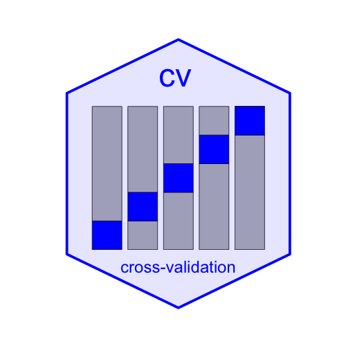

# cv package for R: Cross-Validating Regression Models

The **cv** package for R provides a consistent and extensible framework
for cross-validating standard R statistical models. Some of the
functions supplied by the package:

- [`cv()`](https://gmonette.github.io/cv/reference/cv.md) is a generic
  function with a default method, computationally efficient `"lm"` and
  `"glm"` methods, an `"rlm"` method (for robust linear models), and a
  method for a list of competing models. There are also `"merMod"`,
  `"lme"`, and `"glmmTMB"` methods for mixed-effects models.
  [`cv()`](https://gmonette.github.io/cv/reference/cv.md) supports
  parallel computations.

- [`mse()`](https://gmonette.github.io/cv/reference/cost-functions.md)
  (mean-squared error),
  [`rmse()`](https://gmonette.github.io/cv/reference/cost-functions.md)
  (root-mean-squared error),
  [`medAbsErr()`](https://gmonette.github.io/cv/reference/cost-functions.md)
  (median absolute error), and
  [`BayesRule()`](https://gmonette.github.io/cv/reference/cost-functions.md)
  are cross-validation criteria (“cost functions”), suitable for use
  with [`cv()`](https://gmonette.github.io/cv/reference/cv.md).

- [`cv()`](https://gmonette.github.io/cv/reference/cv.md) also can
  cross-validate a selection procedure (such as the following) for a
  regression model:

  - `cvModelList()` employs CV to select a model from among a number of
    candidates, and then cross-validates this model-selection procedure.

  - [`selectStepAIC()`](https://gmonette.github.io/cv/reference/cv.function.md)
    is a predictor-selection procedure based on the `stepAIC()` function
    in the **MASS** package.

  - [`selectTrans()`](https://gmonette.github.io/cv/reference/cv.function.md)
    is a procedure for selecting predictor and response transformations
    in regression, based on the `powerTransform()` function in the
    **car** package.

  - [`selectTransStepAIC()`](https://gmonette.github.io/cv/reference/cv.function.md)
    is a procedure that first selects predictor and response
    transformations and then selects predictors.

For additional introductory information on using the **cv** package, see
the “[Cross-validating regression
models](https://gmonette.github.io/cv/articles/cv.html)” vignette
([`vignette("cv", package="cv")`](https://gmonette.github.io/cv/articles/cv.md)).
There are also vignettes on [cross-validating mixed-effects
models](https://gmonette.github.io/cv/articles/cv-mixed.html)
([`vignette("cv-mixed", package="cv")`](https://gmonette.github.io/cv/articles/cv-mixed.md)),
[cross-validating model
selection](https://gmonette.github.io/cv/articles/cv-selection.html)
([`vignette("cv-selection", package="cv")`](https://gmonette.github.io/cv/articles/cv-selection.md)),
and [computational and technical
notes](https://gmonette.github.io/cv/articles/cv-notes.html)
([`vignette("cv-notes", package="cv")`](https://gmonette.github.io/cv/articles/cv-notes.md)).
The **cv** package is designed to be extensible to other classes of
regression models, other CV criteria, and other model-selection
procedures; for details, see the “[Extending the cv
package](https://gmonette.github.io/cv/articles/cv-extend.html)”
vignette
([`vignette("cv-extend", package="cv")`](https://gmonette.github.io/cv/articles/cv-extend.md)).

## Installing the cv package

To install the current version of the **cv** package from CRAN:

    install.packages("cv")

To install the development version of the **cv** package from GitHub:

    if (!require(remotes)) install.packages("remotes")
    remotes::install_github("gmonette/cv", build_vignettes=TRUE,
      dependencies=TRUE)
